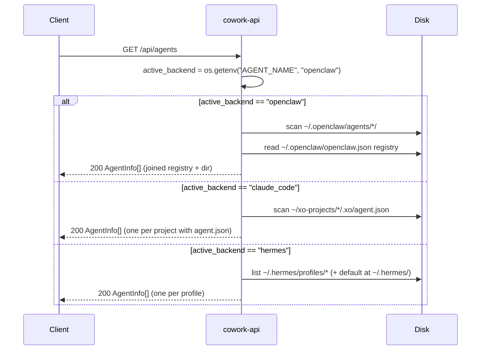
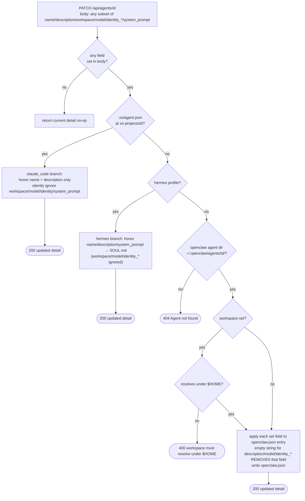
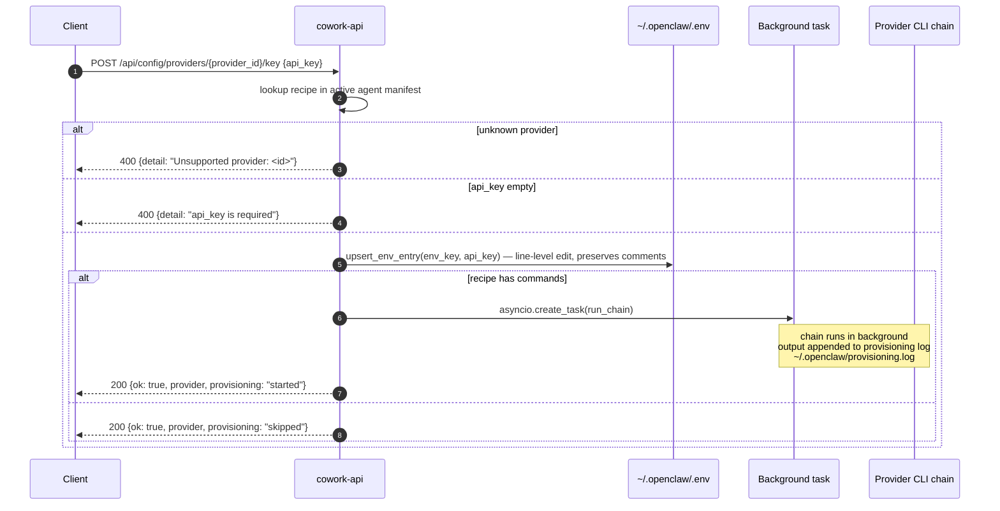

# Agents, models & config API — frontend integration guide

For frontends managing the workspace's agents (the OpenClaw / claude_code records), listing available models, and reading configuration. Covers `/api/agents/*`, `/api/models`, and `/api/config/*`.

**Base URL:** `http://${HOST:-localhost}:${PORT:-5002}`
**Auth:** none required at this surface.

---

## At a glance

**Agents**

| Endpoint | Purpose |
|---|---|
| `GET /api/agents` | List all agents (filtered by `AGENT_NAME` env) |
| `POST /api/agents` | Create new agent (`openclaw` or `claude_code`) |
| `GET /api/agents/{agent_id}` | Full agent detail |
| `PATCH /api/agents/{agent_id}` | Update name / description / workspace / model |

**Models**

| Endpoint | Purpose |
|---|---|
| `GET /api/models` | List available models for active backend |

**Config**

| Endpoint | Purpose |
|---|---|
| `GET /api/config/api-key` | `{has_key, provider}` |
| `GET /api/config/providers` | Always `[]` (placeholder) |
| `GET /api/config/openai-subscription` | OpenAI Pro/Team status |
| `GET /api/config/openyak-account` | Stub: `{linked: false}` |
| `GET /api/config/ollama` | Stub: `{installed: false}` |
| `GET /api/config/local` | Stub: `{available: false}` |
| `GET /api/config/openclaw` | Full `openclaw.json` (sensitive values masked) |
| `GET /api/config/workspace` | ⭐ projects-root + active backend |
| `POST /api/config/providers/{id}/key` | Provision a provider API key |

> [!TIP]
> `GET /api/config/workspace` is the canonical first call any frontend should make on boot. Always read this to discover the projects root; **never hardcode `~/xo-projects`** because containerized workspaces use `/home/coder/xo-projects`.

---

## 1. The agent concept

Three backends register agents differently. The frontend's job is mostly to display them uniformly.

| Backend | Storage | Root |
|---|---|---|
| `openclaw` | Entry in `~/.openclaw/openclaw.json` + a directory at `~/.openclaw/agents/<id>/` | `AGENTS_DIR` |
| `claude_code` | An xo-project under `~/xo-projects/<id>/` with a `.xo/agent.json` record | `xo_projects_root()` |
| `hermes` | A profile dir under `~/.hermes/profiles/<name>/` (or `~/.hermes/` for the `default` profile) | `HERMES_DIR` |

`GET /api/agents` returns whichever backend is active per the `AGENT_NAME` env var (default `"openclaw"`). The frontend cannot list multiple backends at once through this endpoint, to see another backend's agents the server must be started with the matching `AGENT_NAME` value.

The unified `AgentInfo` shape:

```jsonc
{
  "name":          "blackhole",                 // primary id (normalized)
  "description":   "Internal research project",
  "mode":          "primary",                    // currently always "primary"
  "tools":         [],                           // reserved
  "permissions":   { "rules": [] },              // reserved
  "system_prompt": null,                         // reserved
  "temperature":   null,                         // reserved
  "metadata": {
    "backend":      "openclaw" | "claude_code",
    "openclaw_id":  "blackhole",                 // openclaw only
    "display_name": "Blackhole",                 // pretty name
    "workspace":    "/Users/me/.openclaw/agents/blackhole"
  }
}
```

---

## 2. `GET /api/agents`



List all agents for the active backend.

### Query parameters

None.

### Response (200)

A bare array of `AgentInfo` objects. Empty array if no agents are configured.

```jsonc
[
  {
    "name":          "main",
    "description":   "Default agent",
    "mode":          "primary",
    "tools":         [],
    "permissions":   { "rules": [] },
    "system_prompt": null,
    "temperature":   null,
    "metadata": {
      "backend":      "openclaw",
      "openclaw_id":  "main",
      "display_name": "main",
      "workspace":    "/Users/me/.openclaw/agents/main"
    }
  },
  ...
]
```

### Behavior by backend

- **OpenClaw** (`AGENT_NAME=openclaw`): scans `~/.openclaw/agents/*/`, joins each with its `openclaw.json` registry entry, returns one `AgentInfo` per directory.
- **Claude Code** (`AGENT_NAME=claude_code`): scans `~/xo-projects/*/`, returns one `AgentInfo` per folder that has `.xo/agent.json`.

Folders without the corresponding metadata file are silently skipped.

---

## 3. `POST /api/agents`

```mermaid
flowchart TD
  in[POST /api/agents<br/>{name, id?, description?, workspace?, backend?}] --> norm[agent_id = normalize_agent_id id or name]
  norm --> br{backend?}
  br -- openclaw --> oc1{id == 'main'?}
  oc1 -- yes --> e400a([400 reserved name])
  oc1 -- no --> oc2{exists in<br/>openclaw.json?}
  oc2 -- yes --> e409a([409 agent already exists in openclaw.json])
  oc2 -- no --> oc3{agents/&lt;id&gt;/<br/>dir exists?}
  oc3 -- yes --> e409b([409 agent dir already exists])
  oc3 -- no --> oc4{workspace set?}
  oc4 -- yes --> oc5{resolves under $HOME?}
  oc5 -- no --> e400b([400 workspace must resolve under $HOME])
  oc5 -- yes --> oc_write
  oc4 -- no --> oc_default[workspace = ~/.openclaw/agents/&lt;id&gt;/]
  oc_default --> oc_write
  oc_write[apply_agent_list_entry → openclaw.json<br/>ensure_openclaw_agent_disk → bootstrap dir]
  oc_write --> okoc([200 AgentInfo])
  br -- claude_code --> cc1{.xo/agent.json<br/>exists?}
  cc1 -- yes --> e409c([409 Claude Code agent already exists])
  cc1 -- no --> cc2[scaffold_project<br/>~/xo-projects/&lt;id&gt;/ + canonical template]
  cc2 --> cc3[write .xo/agent.json<br/>{id, name, description, backend: claude_code, created_at}]
  cc3 --> okcc([200 AgentInfo])
  br -- hermes --> hm[provision hermes profile under ~/.hermes/profiles/&lt;name&gt;/<br/>or default at ~/.hermes/]
  hm --> okhm([200 AgentInfo])
```

Create a new agent. Behavior diverges sharply by backend.

### Request body (Pydantic `CreateAgentBody`)

```jsonc
{
  "name":         "Blackhole",                          // REQUIRED, 1-200 chars
  "id":           "blackhole",                           // optional, ≤80 chars; default = normalized name
  "description":  "Internal research project",          // optional, ≤4000 chars
  "workspace":    "/Users/me/some/folder",              // optional, ≤2048 chars; openclaw only
  "backend":      "openclaw"                             // "openclaw" | "claude_code" | "hermes"; default "openclaw"
}
```

### 3.1 OpenClaw branch (`backend == "openclaw"`)

```
1. agent_id = normalize_agent_id(id ?? name)
   (lowercase, kebab-case; e.g. "Blackhole" → "blackhole")
2. agent_id == "main" → 400 (reserved name)
3. If openclaw.json already has this id → 409
4. If ~/.openclaw/agents/<id>/ already exists → 409
5. workspace:
     - If body.workspace is set: must resolve under $HOME → else 400
     - Else: ~/.openclaw/agents/<id>/  (default; never under xo-projects/)
6. apply_agent_list_entry(...) writes openclaw.json
7. ensure_openclaw_agent_disk(...) creates the agent dir + bootstrap files
8. Return AgentInfo
```

**Important nuance.** OpenClaw agents are NOT projects. They never get scaffolded under `~/xo-projects/`. The "project" is selected per-chat at chat time (via the `workspace` field on `/api/chat/prompt`). Agents are personas / model configurations.

#### Response (200)

The freshly-created `AgentInfo`.

#### Errors

```
400: {"detail": "Agent id \"main\" is reserved; choose another id or name."}
400: {"detail": "workspace must resolve to a path under your home directory."}
409: {"detail": "Agent \"blackhole\" already exists in openclaw.json."}
409: {"detail": "Agent directory \"blackhole\" already exists under ~/.openclaw/agents."}
500: {"detail": "<exception>"}
```

### 3.2 Claude Code branch (`backend == "claude_code"`)

```
1. agent_id = normalize_agent_id(id ?? name)
2. If ~/xo-projects/<id>/.xo/agent.json already exists → 409
3. scaffold_project(agent_id, display_name=name, description=description)
   (creates ~/xo-projects/<id>/ with the canonical template — see frontend-files-api.md §7.4)
4. Write .xo/agent.json with {id, name, description, backend:"claude_code", created_at}
5. Return AgentInfo
```

**For Claude Code, an agent IS a project.** The `workspace` field is ignored — the workspace is always `xo-projects/<id>/`. The full project template (AGENTS.md, PROJECT.md, OBJECTIVES.md, PLAN.md, PROGRESS.md, memory/, .xo/) is materialized.

It's safe for the project folder to already exist (e.g., from a prior `/api/files/mkdir` call) — only the `.xo/agent.json` record being present blocks creation.

#### Response (200)

```jsonc
{
  "name":          "blackhole",
  "description":   "Internal research project",
  "mode":          "primary",
  "tools":         [],
  "permissions":   { "rules": [] },
  "system_prompt": null,
  "temperature":   null,
  "metadata": {
    "backend":      "claude_code",
    "display_name": "Blackhole",
    "workspace":    "/Users/me/xo-projects/blackhole"
  }
}
```

#### Errors

```
409: {"detail": "Claude Code agent \"blackhole\" already exists."}
500: {"detail": "<exception>"}
```

### 3.3 Frontend example

```typescript
async function createAgent(body: {
  name: string;
  id?: string;
  description?: string;
  workspace?: string;
  backend?: "openclaw" | "claude_code";
}) {
  const res = await fetch("/api/agents", {
    method: "POST",
    headers: { "Content-Type": "application/json" },
    body: JSON.stringify(body),
  });
  if (!res.ok) {
    const err = await res.json();
    if (res.status === 409) throw new Error("Agent already exists");
    throw new Error(err.detail);
  }
  return res.json();
}
```

---

## 4. `GET /api/agents/{agent_id}`

```mermaid
sequenceDiagram
  participant C as Client
  participant A as cowork-api
  participant FS as Disk
  C->>A: GET /api/agents/{agent_id}
  Note over A: get_agent_detail(aid) — dispatch by backend in order
  A->>FS: try ~/xo-projects/&lt;aid&gt;/.xo/agent.json
  alt found
    A-->>C: 200 claude_code detail
  else
    A->>FS: try ~/.hermes/profiles/&lt;aid&gt;/ (or ~/.hermes/ for "default")
    alt found
      A-->>C: 200 hermes detail
    else
      A->>FS: try ~/.openclaw/openclaw.json + ~/.openclaw/agents/&lt;aid&gt;/
      alt found
        Note over A: assemble identity + config_entry +<br/>workspace_files (AGENTS.md etc. 64KB max) +<br/>on_disk (models, auth-state, auth-profiles redacted) +<br/>sessions index + openclaw_global_auth
        A-->>C: 200 openclaw detail
      else
        A-->>C: 404 {detail: 'Agent "<id>" not found'}
      end
    end
  end
```

Detailed agent snapshot — much richer than the list-view shape. Includes config entry, workspace docs, on-disk model catalog, redacted auth profiles, sessions index, and global auth summary.

### Response (200) — OpenClaw

```jsonc
{
  "id":            "blackhole",
  "display_name":  "Blackhole",
  "description":   "Internal research project",
  "workspace":     "/Users/me/.openclaw/agents/blackhole",
  "model":         "claude-sonnet-4.5",                       // pretty model name
  "model_raw":     "anthropic/claude-sonnet-4-5-20250929",   // raw config string
  "identity": {
    "name":   "Blackhole",
    "emoji":  "🌌",
    "bio":    "Internal research project"
  },
  "config_entry":  { /* raw entry from openclaw.json */ },
  "agents_defaults": { /* openclaw.json's "agents.defaults" block */ },
  "workspace_files": {
    "AGENTS.md":     "<file contents up to 64KB or empty if missing>",
    "PROJECT.md":    "...",
    "PLAN.md":       "...",
    "PROGRESS.md":   "...",
    "OBJECTIVES.md": "..."
  },
  "on_disk": {
    "agent_dir":      "/Users/me/.openclaw/agents/blackhole/agent",
    "models_catalog": { /* models.json */ },
    "auth_state":     { /* auth-state.json (NOT redacted — usually safe metadata) */ },
    "auth_profiles":  { /* auth-profiles.json with secrets redacted */ }
  },
  "sessions": {
    "index_path":   "/Users/me/.openclaw/agents/blackhole/sessions/sessions.json",
    "count":        12,
    "session_ids":  ["9d4e...", ...]                          // first 80, sorted
  },
  "openclaw_global_auth": { /* summary of openclaw.json's global auth.profiles */ },
  "backend":       "openclaw"
}
```

### Response (200) — Claude Code

```jsonc
{
  "id":            "blackhole",
  "display_name":  "Blackhole",
  "description":   "Internal research project",
  "workspace":     "/Users/me/xo-projects/blackhole",
  "model":         null,                                       // not tracked for claude_code
  "model_raw":     null,
  "identity":      { "name": null, "emoji": null, "bio": null },
  "config_entry":  {},
  "agents_defaults": {},
  "workspace_files": {},
  "on_disk": {
    "agent_dir":     "/Users/me/xo-projects/blackhole",
    "models_catalog": null,
    "auth_state":    null,
    "auth_profiles": null
  },
  "sessions": {
    "index_path":  "/Users/me/xo-projects/blackhole/.sessions",
    "count":       0,
    "session_ids": []
  },
  "openclaw_global_auth": {},
  "backend":       "claude_code"
}
```

### Errors

```
404: {"detail": "Agent \"blackhole\" not found"}
```

### Security note

The `auth_profiles` block has every secret-y key (`token`, `api_key`, `client_secret`, `refresh_token`, etc.) recursively replaced with `"***"`. The wrapper structure is preserved so the UI can show "this account has X profiles" without leaking the keys themselves.

---

## 5. `PATCH /api/agents/{agent_id}`



Update mutable fields on an agent. Behavior diverges by backend.

### Request body (Pydantic `UpdateAgentBody`)

All fields optional. Only fields **present in the JSON body** (not just non-null) are applied.

```jsonc
{
  "name":             "New Name",
  "description":      "New description",
  "workspace":        "/Users/me/new/path",
  "model":            "anthropic/claude-opus-4-1",
  "identity_name":    "Codename",
  "identity_emoji":   "🚀",
  "system_prompt":    "..."                     // Hermes-only — writes to <profile>/SOUL.md
}
```

### 5.1 OpenClaw branch

```
1. If agent dir doesn't exist → 404.
2. If body has no fields set → return current agent detail (no-op).
3. Apply each set field to the openclaw.json entry.
4. If workspace set: must resolve under $HOME → else 400.
5. Empty strings for description/model/identity_* fields REMOVE that field
   from the entry (set "" → unset).
6. Write openclaw.json. Return updated agent detail.
```

### 5.2 Claude Code branch

Only `name` and `description` are honored. `workspace`, `model`, `identity_*` are silently ignored.

```
1. If .xo/agent.json doesn't exist → falls through to OpenClaw → 404.
2. Update name and/or description. Write back. Return updated detail.
```

### Response (200)

Full agent detail, same shape as `GET /api/agents/{id}`.

### Errors

```
404: {"detail": "Agent \"blackhole\" not found"}
400: {"detail": "workspace must resolve to a path under your home directory"}
500: {"detail": "<exception>"}
```

---

## 6. `GET /api/models`

List models the active backend can target. The "model" here is OpenClaw's "agent" — i.e., one row per registered agent so the UI can show `<prefix>/<agentId>` as the model identifier.

### Response (200)

```jsonc
[
  {
    "id":          "openclaw/blackhole",                       // <prefix>/<normalized-agent-id>
    "name":        "Blackhole",                                 // display name
    "provider_id": "openclaw",
    "capabilities": {
      "vision":         true,
      "tool_use":       true,
      "thinking":       true,
      "extended_output": true
    },
    "pricing":     { "prompt": 0, "completion": 0 },           // currently zeros
    "metadata":    { "openclaw_agent_id": "blackhole" }
  },
  ...
]
```

If no agents are registered, returns a single fallback entry for `<prefix>/main`.

The `capabilities` block is currently the same for every entry (read from `OPENCLAW_MODEL_CAPABILITIES` constant). Pricing is always zero — costs are tracked per-token after the fact, not per-model.

---

## 7. `GET /api/config/api-key`

> Sections 7-13 are simple read endpoints. They share the same shape: client GETs, cowork-api reads a local file (or returns a constant), responds. No diagrams below — the wire interaction is trivial.

Whether a provider API key is configured. The current implementation is naive — it always returns `has_key: true` for the active agent.

### Response (200)

```jsonc
{
  "has_key":  true,
  "provider": "openclaw"   // active agent name (manifest's `name` field)
}
```

This is consumed by the UI to decide whether to show a "Connect" or "Connected" state. Treat it as advisory — actual presence of credentials is determined inside the runtime.

---

## 8. `GET /api/config/providers`

```json
[]
```

Always empty. Reserved for future provider listing — currently unimplemented.

---

## 9. `GET /api/config/openai-subscription`

OpenAI Pro/Team subscription status (when integrated; currently a stub).

### Response (200)

```jsonc
{
  "is_connected": false,
  "email":        "",
  "needs_reauth": false
}
```

---

## 10. `GET /api/config/openyak-account`

```json
{ "linked": false }
```

Stub.

---

## 11. `GET /api/config/ollama`

```json
{ "installed": false }
```

Stub. See also `/api/ollama/status` (also a stub) under [`frontend-misc-api.md`](frontend-misc-api.md).

---

## 12. `GET /api/config/local`

```json
{ "available": false }
```

Stub.

---

## 13. `GET /api/config/openclaw`

Read the full `~/.openclaw/openclaw.json` config file with secrets masked.

### Response (200)

```jsonc
{
  /* the full openclaw.json contents */
  "auth": {
    "profiles": {
      "<id>": {
        "provider":     "anthropic",
        "email":        "user@example.com",
        "expires":      "2026-08-01T...",
        "access_token": "***",                  // masked
        "refresh_token": "***"                   // masked
      }
    }
  },
  "agents": { /* ... */ },
  /* etc */
}
```

### Errors

```
404: {"detail": "openclaw.json not found"}
```

---

## 14. `GET /api/config/workspace` ⭐

```mermaid
sequenceDiagram
  participant C as Client
  participant A as cowork-api
  participant FS as Disk
  C->>A: GET /api/config/workspace
  A->>A: backend = os.getenv("AGENT_NAME", "openclaw")
  A->>FS: ensure XO_PROJECTS_ROOT (default ~/xo-projects) exists; mkdir if missing
  A-->>C: 200 {roots: {<backend>: "<root path>"}, default: "<backend>"}
```

The endpoint frontends MUST call before creating projects — it returns the canonical projects-root path so paths aren't hardcoded.

### Response (200)

```jsonc
{
  "roots": {
    "openclaw": "/Users/me/xo-projects"                // ONLY the active backend appears here
  },
  "default":   "openclaw"                                // active backend (AGENT_NAME env var)
}
```

**Important:** `roots` contains exactly **one key** — the active backend's id (whichever `AGENT_NAME` is set to on the server, default `"openclaw"`). The other backends are NOT listed. To get the projects root, always read `roots[default]` rather than hardcoding a key:

```typescript
const cfg = await fetch("/api/config/workspace").then(r => r.json());
const projectsRoot = cfg.roots[cfg.default];   // never cfg.roots.openclaw directly
```

The path comes from `XO_PROJECTS_ROOT` env var (default `~/xo-projects`). The directory is created on first read if missing.

### Frontend usage

```typescript
// Read it once on app boot, cache it, use it everywhere
const cfg = await fetch("/api/config/workspace").then(r => r.json());
const projectsRoot = cfg.roots[cfg.default];
// projectsRoot is what you pass as `path: ${projectsRoot}/<id>` to /api/files/mkdir
```

**Don't hardcode `~/xo-projects`** — the env var override exists for containerized deployments where it could be `/home/coder/xo-projects` or similar.

---

## 15. `POST /api/config/providers/{provider_id}/key`



Provision a provider API key. Persists to the agent's env file (line-level, comment-preserving) and kicks off a background CLI chain to register the key with the runtime.

### Path parameter

`provider_id` — must match a key in the active agent's manifest's `providers` block (e.g., `anthropic`, `openai`). Unknown providers → 400.

### Request body

```jsonc
{
  "api_key": "sk-ant-..."
}
```

### Behavior

```
1. Lookup recipe in agent manifest. Unknown provider → 400.
2. Validate api_key non-empty → 400.
3. upsert_env_entry(env_key, api_key) writes to ~/.openclaw/.env.
   Line-level edit: preserves comments, ordering, blank lines, unrelated keys.
4. Render recipe.commands → list of subprocess argvs.
5. asyncio.create_task → run the chain in the background, append to provisioning log.
   The HTTP response returns BEFORE the chain finishes.
```

### Response (200)

```jsonc
{
  "ok":           true,
  "provider":     "anthropic",
  "provisioning": "started"           // or "skipped" if recipe has no commands
}
```

### Errors

```
400: {"detail": "Unsupported provider: <id>"}
400: {"detail": "Invalid JSON body"}
400: {"detail": "api_key is required"}
500: {"detail": "Failed to save key: <reason>"}
500: {"detail": "Invalid provider recipe for '<id>': <reason>"}
```

### Important caveat

The CLI chain runs in the background and the user gets no real-time feedback. To diagnose failures, the frontend should display the agent's provisioning log (path is `agent.provisioning_log` — typically `~/.openclaw/provisioning.log`). This isn't currently exposed via API; the user reads it from disk.

---

## 16. Quick reference

### Endpoint cheat sheet

```
GET    /api/agents                        list active-backend agents
POST   /api/agents                        {name, id?, description?, workspace?, backend?}
GET    /api/agents/{id}                   detail
PATCH  /api/agents/{id}                   {name?, description?, workspace?, model?, identity_*?}

GET    /api/models                        list <prefix>/<agent_id> targets

GET    /api/config/api-key                {has_key, provider}
GET    /api/config/providers              []
GET    /api/config/openai-subscription    {is_connected, email, needs_reauth}
GET    /api/config/openyak-account        {linked: false}
GET    /api/config/ollama                 {installed: false}
GET    /api/config/local                  {available: false}
GET    /api/config/openclaw               full openclaw.json (masked)
GET    /api/config/workspace              ⭐ {roots, default}
POST   /api/config/providers/{id}/key     {api_key} → {ok, provisioning: "started"}
```

### Backend selection

The active backend is decided by the **`AGENT_NAME` env var** on the server (default `"openclaw"`). All listing endpoints (`/api/agents`, `/api/models`) filter by it. To browse Claude Code agents, the server itself must be started with `AGENT_NAME=claude_code` — there is no per-request override.

### Project creation idiom (canonical)

```typescript
// 1. Discover projects root
const cfg = await fetch("/api/config/workspace").then(r => r.json());
const projectsRoot = cfg.roots[cfg.default];

// 2. Create the agent (Claude Code path scaffolds the project)
await fetch("/api/agents", {
  method: "POST",
  headers: { "Content-Type": "application/json" },
  body: JSON.stringify({
    name: "Blackhole",
    backend: "claude_code",
    description: "...",
  }),
});
// Agent is now at ${projectsRoot}/blackhole/, fully scaffolded
```

For OpenClaw: a separate flow — `POST /api/agents` creates the registry entry + agent dir, but the user picks the project workspace per-chat.
