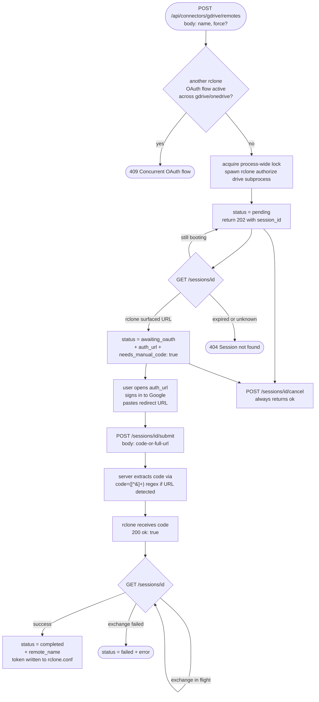
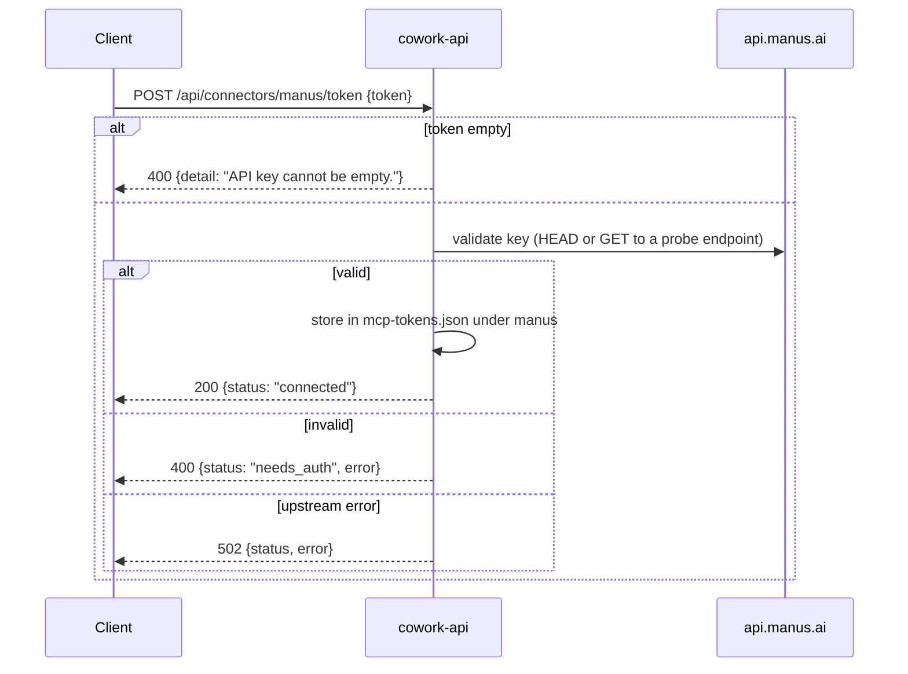

# Connectors API — frontend integration guide

For frontends that wire up external integrations: Google Drive, OneDrive, GitHub, Vercel, Manus, and Composio. All six live under `/api/connectors/*` plus a few callback / discovery endpoints. Each follows a similar **status / connect / disconnect / reconnect** shape, but the connect step varies dramatically by service.

**Base URL:** `http://${HOST:-localhost}:${PORT:-5002}`
**Auth:** none required at this surface — credentials are stored locally in `<repo>/mcp-tokens.json` or `<repo>/rclone.conf`. Composio is the exception: Composio's hosted dashboard is the source of truth for connection state.

---

## At a glance

| Connector | Connect flow |
|---|---|
| Google Drive | `rclone` subprocess + OAuth (manual code paste) |
| OneDrive | `rclone` subprocess + OAuth (manual code paste) |
| GitHub | Either paste a PAT, or run `gh auth login` device flow |
| Vercel | Either paste an API token, or OAuth 2.1 PKCE (popup) |
| Manus | Paste an API key |
| Composio (early access) | OAuth popup or API key per toolkit, brokered by Composio |

Each connector's status object follows the same canonical statuses:

```
"connected"   — credentials valid; integration works
"needs_auth"  — no credentials stored, or stored credentials invalid
"failed"      — terminal error during connect/exchange (CLI flow only)
"pending"     — async flow in progress (rclone, gh CLI)
"awaiting_oauth" — rclone has the auth URL, waiting for user to paste code
```

---

## 1. Google Drive — `/api/connectors/gdrive/*`

Backed by the system `rclone` binary. cowork-api spawns `rclone authorize drive`, captures the auth URL, the user opens it, signs in, and pastes the redirect URL back. The token gets written into `<repo>/rclone.conf` as a named remote.

> [!IMPORTANT]
> **OAuth scope:** `drive.file` (not `drive`). This means rclone (and therefore every endpoint here) can ONLY see files and folders that rclone itself created. A folder the user made manually in the Google Drive web UI will NOT show up in `/folders`, cannot be targeted by `/mkdir` / `/rmdir` / `/upload` in a write-through sense, etc. This is a deliberate least-privilege design: the user authorizes a narrow surface and the connector physically cannot exfiltrate the rest of their Drive.

### 1.1 Flow at a glance



The same diagram covers the three sub-endpoints (`POST /remotes`, `GET /sessions/{id}`, `POST /sessions/{id}/submit`). Per-endpoint diagrams in §1.3–1.5 below are omitted to avoid repeating this flow.

### 1.2 `GET /api/connectors/gdrive/remotes`

List all configured Google Drive remotes.

#### Response (200)

```jsonc
{
  "remotes": [
    { "name": "gdrive-personal", "type": "drive" },
    { "name": "gdrive-work",     "type": "drive" }
  ]
}
```

#### Errors

```
503: {"detail": "Could not reach rclone daemon. Check that rclone is installed and running."}
```

### 1.3 `POST /api/connectors/gdrive/remotes`

Start a new connect flow. Returns 202 with a session id; the actual OAuth happens asynchronously.

#### Request body (Pydantic `CreateRemoteBody`)

```jsonc
{
  "name":  "gdrive-personal",       // required; rclone remote name
  "force": false                     // optional; if true, overwrite existing remote with same name
}
```

#### Response (202)

```jsonc
{
  "session_id": "abc-uuid",
  "status":     "pending"
}
```

#### Errors

```
400: {"detail": "<reason>"}                    invalid remote name
409: {"detail": "Concurrent OAuth flow already running for gdrive/onedrive"}
503: {"detail": "Could not reach rclone daemon."}
```

> [!CAUTION]
> The `409` is important: **only one rclone-driven OAuth flow can be active at a time across both `gdrive` and `onedrive`** (they share port `:53682`). The frontend must serialize. There's a process-wide lock in `services/cowork_agent/rclone_oauth_lock.py`.

### 1.4 `GET /api/connectors/gdrive/sessions/{session_id}`

Poll the connect flow's status.

#### Response (200)

The shape varies with `status`:

```jsonc
// Status: pending — flow just started, rclone hasn't surfaced the auth URL yet
{ "status": "pending" }

// Status: awaiting_oauth — auth URL ready, waiting for user
{
  "status":            "awaiting_oauth",
  "auth_url":          "https://accounts.google.com/o/oauth2/v2/auth?...",
  "needs_manual_code": true             // always true; rclone is configured for manual paste
}

// Status: completed — remote successfully written to rclone.conf
{
  "status":      "completed",
  "remote_name": "gdrive-personal"
}

// Status: failed
{
  "status": "failed",
  "error":  "<reason>"
}
```

#### 404

```json
{ "detail": "Session not found or expired." }
```

Sessions are kept in memory; a server restart loses them.

### 1.5 `POST /api/connectors/gdrive/sessions/{session_id}/submit`

Submit the OAuth code (or full redirect URL) the user pasted from the browser.

#### Request body (Pydantic `SubmitCodeBody`)

```jsonc
{
  "code": "4/0AeanSxUz...code-or-full-url"
}
```

The endpoint accepts both:
- A bare authorization code: `4/0AeanS...`
- A full redirect URL: `http://localhost:53682/?code=4/0AeanS...&scope=...`

If a URL is detected (matches `[?&]code=([^&]+)`), the code is extracted automatically.

#### Response (200)

```json
{ "ok": true }
```

After this call, poll `/sessions/{id}` again to see the flow flip to `completed` (or `failed`). The token exchange happens server-side; this endpoint just hands rclone the code.

#### Errors

```
400: {"detail": "Session is not waiting for a verification code."}
404: {"detail": "Session not found or expired."}
```

### 1.6 `POST /api/connectors/gdrive/sessions/{session_id}/cancel`

Abort an in-progress flow. Always returns 200 even if the session is unknown.

#### Response (200)

```json
{ "ok": true }
```

### 1.7 `DELETE /api/connectors/gdrive/remotes/{name}`

Delete a configured remote from `rclone.conf`.

#### Response (204)

No body.

#### Errors

```
500: {"detail": "<rclone exit reason>"}
503: {"detail": "Could not reach rclone daemon."}
```

### 1.8 Folder management & uploads ⭐ NEW (PR #33)

```mermaid
sequenceDiagram
  participant C as Client
  participant A as cowork-api
  participant RC as rclone
  participant GD as Google Drive (drive.file scope)
  C->>A: POST mkdir / rmdir / upload / GET folders {name path-param}
  A->>A: verify remote name exists in rclone.conf<br/>else 404
  A->>A: validate path segments<br/>no '' '.' '..'<br/>strip leading '/'
  alt mkdir
    A->>RC: rclone mkdir <remote>:<path>
  else folders
    A->>RC: rclone lsjson <remote>: --dirs-only --max-depth 1
  else rmdir
    A->>RC: rclone purge <remote>:<path>
    Note over RC,GD: destructive; only removes<br/>files rclone created
  else upload
    Note over A,RC: stream raw bytes body → rclone rcat stdin<br/>~64 KiB ring buffer for stderr<br/>kill subprocess on client disconnect
    A->>RC: rclone rcat <remote>:<path>/<filename><br/>--size <Content-Length> if present
  end
  RC->>GD: Drive API call
  GD-->>RC: result
  RC-->>A: stdout/exit code
  A-->>C: 200 {ok, path[, size]} or 4xx/5xx error
```

Four endpoints that operate on an already-connected remote. All four take `name` as a path parameter (the remote name from `rclone.conf`, e.g. `gdrive-personal`) and return 404 if that remote doesn't exist.

Under the `drive.file` scope these only see files/folders rclone itself created — see the scope note at the top of §1.

#### 1.8.1 `POST /api/connectors/gdrive/remotes/{name}/mkdir`

Create a folder on the remote.

##### Request body (Pydantic `MkdirBody`)

```jsonc
{
  "path": "research/sources"        // required; "/" separators OK, leading "/" trimmed
}
```

The path is validated server-side:
- Must be non-empty after trim.
- Each segment must be non-empty, not `.`, not `..`.
- A leading `/` is silently stripped (so `"/foo"` and `"foo"` mean the same thing).

##### Response (200)

```jsonc
{ "ok": true, "path": "research/sources" }
```

##### Errors

```
400: {"detail": "Folder path is required."}
400: {"detail": "Invalid folder path."}                       // segment was "", ".", or ".."
400: {"detail": "<rclone error message>"}                     // rclone non-zero exit
404: {"detail": "Remote 'gdrive-personal' not found."}
503: {"detail": "Could not reach rclone."}
```

#### 1.8.2 `GET /api/connectors/gdrive/remotes/{name}/folders`

List top-level folders on the remote (only depth 1).

##### Response (200)

```jsonc
{
  "folders": [
    { "name": "research",       "modified": "2026-05-12T10:14:22Z" },
    { "name": "marketing",      "modified": "2026-05-09T03:01:55Z" },
    { "name": "shared-projects","modified": null }              // modified may be null
  ]
}
```

Empty array if nothing exists (or nothing within scope).

##### Errors

```
400: {"detail": "rclone returned non-JSON output: <reason>"}
404: {"detail": "Remote 'gdrive-personal' not found."}
503: {"detail": "Could not reach rclone."}
```

#### 1.8.3 `POST /api/connectors/gdrive/remotes/{name}/rmdir`

Purge a folder and everything under it that rclone can see. **This is destructive** — runs `rclone purge`, not `rclone rmdir`. Use sparingly and confirm in the UI.

##### Request body (Pydantic `RmdirBody`)

```jsonc
{
  "path": "research/old-experiments"   // same validation rules as /mkdir
}
```

##### Response (200)

```jsonc
{ "ok": true, "path": "research/old-experiments" }
```

##### Errors

```
400: {"detail": "Folder path is required."}
400: {"detail": "Invalid folder path."}
400: {"detail": "<rclone error message>"}                      // e.g. folder doesn't exist
404: {"detail": "Remote 'gdrive-personal' not found."}
503: {"detail": "Could not reach rclone."}
```

##### Important nuance

Under `drive.file` scope, `purge` only removes files and folders rclone created. If a user dragged something into a folder via the Drive web UI, `rmdir` here will leave those items behind and the folder itself may not be removed.

#### 1.8.4 `POST /api/connectors/gdrive/remotes/{name}/upload`

Stream an upload directly to `rclone rcat` stdin. **No disk spool, no RAM buffer** — bytes flow body → rclone → Google in one pipe.

##### Query parameters

| Name | Required | Notes |
|---|---|---|
| `path` | no | Target folder on the remote. Defaults to root. Same validation as `/mkdir`. |
| `filename` | yes | Filename to use on the remote. Validated — no `/`, no `\`, no `.` / `..`, no control chars. |

##### Headers

- `Content-Type: application/octet-stream` (recommended; not enforced)
- `Content-Length: <bytes>` — **strongly recommended.** When present, rclone gets `--size` so it can detect partial uploads. When absent, rclone still uploads but in a less reliable mode.

##### Request body

Raw file bytes — NOT multipart, NOT base64. Just the bytes.

##### Size cap

`MAX_UPLOAD_BYTES = 500 MiB`. Enforced via `Content-Length` when provided. If the header is missing or non-numeric, no preflight check happens; rclone will still fail later if it overruns its own limits.

##### Response (200)

```jsonc
{
  "ok":   true,
  "path": "research/sources/proposal.pdf",     // final remote-relative path
  "size": 48329                                 // bytes (echoed back from Content-Length, or null)
}
```

##### Errors

```
400: {"detail": "Filename is required."}
400: {"detail": "Filename must not contain '/' or '\\'."}
400: {"detail": "Invalid filename."}                          // "." or ".."
400: {"detail": "Filename contains control characters."}
400: {"detail": "Invalid folder path."}
404: {"detail": "Remote 'gdrive-personal' not found."}
413: {"detail": "File exceeds the 500 MiB cap."}
502: {"detail": "rclone upload failed: <stderr last 64KiB>"}
503: {"detail": "Could not reach rclone."}
```

##### Frontend example (TS, browser File API)

```typescript
async function uploadToGDrive(
  remoteName: string,
  file: File,
  folderPath = "",
) {
  const url = new URL(
    `/api/connectors/gdrive/remotes/${encodeURIComponent(remoteName)}/upload`,
    location.origin,
  );
  if (folderPath) url.searchParams.set("path", folderPath);
  url.searchParams.set("filename", file.name);

  const res = await fetch(url.toString(), {
    method: "POST",
    headers: {
      "Content-Type": "application/octet-stream",
      "Content-Length": String(file.size),
    },
    body: file,           // raw bytes — fetch streams a File/Blob automatically
  });

  if (!res.ok) {
    const err = await res.json();
    throw new Error(err.detail);
  }
  return res.json() as Promise<{ ok: true; path: string; size: number | null }>;
}
```

##### Server-side flow (so you know what's happening)

```
1. /api/connectors/gdrive/remotes/{name}/upload
   - Verify remote exists in rclone.conf
   - Read Content-Length, reject if > 500 MiB

2. services/cowork_agent/gdrive_rclone.upload_file_to_remote(...)
   - Validate filename (_validate_upload_filename)
   - Build target string "<remote>:<folder>/<filename>"
   - Pick argv: ["rcat", "--size", <bytes>, target] or ["rcat", target]

3. services/cowork_agent/gdrive_rclone._rclone_cli_stdin_stream(...)
   - Spawn `rclone rcat ...` subprocess
   - Pipe FastAPI's request.stream() into rclone's stdin chunk-by-chunk
   - Drain stderr into a 64 KiB ring buffer
   - On early return / client disconnect: kill the subprocess (no zombies)

4. Return {ok, path, size}
```

The streaming design means a 500 MiB upload uses ~64 KiB of memory on the server, not 500 MiB.

### 1.9 Frontend example

```typescript
async function connectGDrive(name: string) {
  // 1. Start
  const start = await fetch("/api/connectors/gdrive/remotes", {
    method: "POST",
    headers: { "Content-Type": "application/json" },
    body: JSON.stringify({ name }),
  });
  if (start.status === 409) throw new Error("Another OAuth flow is in progress");
  if (!start.ok) throw new Error((await start.json()).detail);
  const { session_id } = await start.json();

  // 2. Poll until awaiting_oauth
  let session;
  for (let i = 0; i < 60; i++) {
    await new Promise(r => setTimeout(r, 1000));
    session = await fetch(`/api/connectors/gdrive/sessions/${session_id}`).then(r => r.json());
    if (session.status === "awaiting_oauth") break;
    if (session.status === "failed") throw new Error(session.error);
  }
  if (session.status !== "awaiting_oauth") throw new Error("Timeout waiting for auth URL");

  // 3. Show the user the URL, get them to paste the redirect
  window.open(session.auth_url, "_blank");
  const userPasted = await promptUserForRedirectUrl();   // your UI

  // 4. Submit
  await fetch(`/api/connectors/gdrive/sessions/${session_id}/submit`, {
    method: "POST",
    headers: { "Content-Type": "application/json" },
    body: JSON.stringify({ code: userPasted }),
  });

  // 5. Poll until completed
  for (let i = 0; i < 30; i++) {
    await new Promise(r => setTimeout(r, 1000));
    session = await fetch(`/api/connectors/gdrive/sessions/${session_id}`).then(r => r.json());
    if (session.status === "completed") return session.remote_name;
    if (session.status === "failed") throw new Error(session.error);
  }
  throw new Error("Token exchange timed out");
}
```

---

## 2. OneDrive — `/api/connectors/onedrive/*`

```mermaid
flowchart TD
  s([POST /api/connectors/onedrive/remotes<br/>{name, force?}]) --> lock{shared rclone OAuth lock<br/>also held by gdrive flow?}
  lock -- yes --> e409([409 Concurrent OAuth flow])
  lock -- no --> spawn[rclone authorize onedrive subprocess]
  spawn --> pending[status = pending]
  pending --> aw[status = awaiting_oauth<br/>auth_url points to login.microsoftonline.com<br/>needs_manual_code: true]
  aw --> submit[POST /sessions/id/submit code-or-URL]
  submit --> done[status = completed + remote_name]
  submit --> fail([status = failed + error])
```

**Identical shape and behavior to the original gdrive six**, just different routes. Replace `/gdrive/` with `/onedrive/`:

```
GET    /api/connectors/onedrive/remotes
POST   /api/connectors/onedrive/remotes                        body: {name, force}
GET    /api/connectors/onedrive/sessions/{session_id}
DELETE /api/connectors/onedrive/remotes/{name}
POST   /api/connectors/onedrive/sessions/{session_id}/cancel
POST   /api/connectors/onedrive/sessions/{session_id}/submit   body: {code}
```

Same status semantics, same error codes, same single-flight lock against gdrive.

The `auth_url` points to Microsoft's OAuth endpoint (`login.microsoftonline.com`) instead of Google's.

> [!WARNING]
> **Asymmetry:** OneDrive does NOT (yet) have the four folder-management / upload endpoints that gdrive shipped in PR #33 (`/mkdir`, `/folders`, `/rmdir`, `/upload`). If parity matters to your UI, either gate those features to gdrive-only or wait for the matching OneDrive PR. The service-layer `onedrive_rclone.py` does not currently expose `mkdir_remote_path` / `list_remote_folders` / etc.

---

## 3. GitHub — `/api/connectors/github/*`

```mermaid
flowchart TD
  pick{user chooses method} -- "PAT" --> pat1[POST /token {token}]
  pat1 --> patshape{starts with ghp_ /<br/>github_pat_ / gho_<br/>OR len &gt;= 30?}
  patshape -- no --> e400a([400 doesn't look like a valid token])
  patshape -- yes --> valhub[GET api.github.com/user with Bearer]
  valhub -- 200 --> store[store in mcp-tokens.json under github<br/>auth_method = pat]
  valhub -- non-200 --> e400b([400 status: needs_auth, error])
  store --> ok([200 status: connected + profile])
  pick -- "gh CLI device flow" --> cli1[POST /cli/start - spawn gh auth login --web]
  cli1 --> parse[parse stdout for user_code + verification_uri]
  parse -- ok --> emit[200 session_id, user_code, verification_uri, expires_in: 900]
  parse -- failed --> e400c([400 detail])
  emit --> user[user opens verification_uri<br/>enters user_code, authorizes]
  user --> poll[POST /cli/poll {session_id}]
  poll -- pending --> poll
  poll -- timeout expired --> e404p([404 Unknown or expired])
  poll -- gh succeeded but token rejected --> e502p([502 status: failed + error])
  poll -- success --> single[200 status: connected + auth_method: cli + profile<br/>SINGLE-CONSUME: session popped<br/>next poll returns 404]
  single --> store_cli[store in mcp-tokens.json under github<br/>auth_method = cli]
  poll -. user cancels .-> cancel[POST /cli/cancel {session_id}<br/>→ {status: cancelled}]
```

Two parallel auth methods. The user can pick either; cowork-api stores the result identically.

| Method | Flow | When to prefer |
|---|---|---|
| **PAT** | User pastes a personal access token | Headless / non-interactive; user already has a PAT |
| **gh CLI** | Device-code flow via `gh auth login --web` | Interactive; user doesn't want to manage PATs |

Only ONE identity is connected at a time — `auth_method` in the status response distinguishes them.

### 3.1 PAT method

#### `POST /api/connectors/github/token`

```jsonc
// request body (Pydantic TokenBody)
{ "token": "ghp_xxx..." }
```

The token format is sanity-checked:

- starts with `ghp_`, `github_pat_`, or `gho_`, OR
- is at least 30 chars long

If neither, returns `400 {"detail": "This doesn't look like a valid GitHub token."}`.

The token is then validated against `GET https://api.github.com/user`.

##### Response (200)

```jsonc
{
  "status":      "connected",
  "auth_method": "pat",
  "username":    "octocat",
  "name":        "The Octocat",
  "avatar_url":  "https://github.com/avatars/octocat",
  "scopes":      "repo, read:org"
}
```

##### Errors

```
400: {"detail": "Token cannot be empty."}
400: {"detail": "This doesn't look like a valid GitHub token."}
400: {"status": "needs_auth", "error": "<reason>"}        validation failed (rate limited, no scopes, etc.)
502: {"status": "<status>",   "error": "<reason>"}        upstream error from api.github.com
```

#### `POST /api/connectors/github/disconnect`

```json
// response (200)
{ "status": "needs_auth" }
```

Deletes the stored token from `mcp-tokens.json`.

#### `POST /api/connectors/github/reconnect`

Re-validate the stored token.

```jsonc
// response (200)
{
  "status":     "connected",
  "username":   "octocat",
  "name":       "The Octocat",
  "avatar_url": "...",
  "scopes":     "repo, read:org"
}

// or if no token stored
{ "status": "needs_auth", "error": "No token stored." }
```

### 3.2 gh CLI device flow

Triple-step: `start` → poll `poll` → `cancel` if user gives up.

#### `POST /api/connectors/github/cli/start`

Empty body. Spawns `gh auth login --web` and parses the output for the device code + verification URL.

##### Response (200)

```jsonc
{
  "session_id":       "abc-uuid",
  "user_code":        "1234-5678",
  "verification_uri": "https://github.com/login/device",
  "expires_in":       900                          // seconds — server-side session TTL
}
```

##### Errors

```
400: {"detail": "<reason>"}        gh missing, parse failure, concurrent session, etc.
```

The frontend should display `user_code` prominently and link to `verification_uri`. The user goes to the URL, enters the code, and authorizes the GitHub OAuth app. Once `expires_in` elapses without a successful poll, the session is evicted server-side and subsequent polls return `status: "not_found"`.

#### `POST /api/connectors/github/cli/poll`

```jsonc
// request body (Pydantic CliSessionBody)
{ "session_id": "abc-uuid" }
```

##### Response (200)

The shape varies with status:

```jsonc
// pending — keep polling (note: user_code + verification_uri are echoed back
// so the frontend can re-display them after a reload without restarting the flow)
{
  "status":           "pending",
  "user_code":        "1234-5678",
  "verification_uri": "https://github.com/login/device"
}

// completed — token now stored, user info attached
{
  "status":      "connected",
  "auth_method": "cli",
  "username":    "octocat",
  "name":        "The Octocat",
  "avatar_url":  "...",
  "scopes":      "repo, read:org"
}

// not_found — session expired or unknown
404: {"detail": "Unknown or expired CLI login session. Start a new one."}

// failed — token validation failed despite gh reporting success
502: {"status": "failed", "error": "<reason>"}
```

> [!CAUTION]
> The `completed` branch is **single-consume**. Once a poll returns `completed`, the server pops the session and the next poll returns `404 not_found`. The frontend must persist the connected state from that single response.

#### `POST /api/connectors/github/cli/cancel`

```jsonc
// request body
{ "session_id": "abc-uuid" }
```

##### Response (200)

```jsonc
{ "status": "cancelled" }   // or {"status": "not_found"} if no such session
```

### 3.3 `GET /api/connectors/github/status`

The unified status endpoint. Reads from `mcp-tokens.json` regardless of which auth method connected.

Note: unlike the `POST /token` / `/reconnect` routes (which construct an explicit response), this endpoint returns the raw `validate_token` result with `auth_method` appended — so it carries an extra `valid` boolean.

#### Response (200)

```jsonc
// connected (PAT or CLI — distinguish via auth_method)
{
  "valid":       true,                          // ← present here (not on /token or /reconnect)
  "status":      "connected",
  "username":    "octocat",
  "name":        "The Octocat",
  "avatar_url":  "...",
  "scopes":      "repo, read:org",
  "auth_method": "pat" | "cli"                  // only present when connected
}

// not connected — no stored token
{ "status": "needs_auth" }

// stored token failed validation (rejected by GitHub)
{
  "valid":  false,
  "status": "needs_auth",
  "error":  "Token is invalid or revoked."
}

// upstream error (rate limited, network down, etc.)
{
  "valid":  false,
  "status": "failed",
  "error":  "GitHub returned HTTP 500."
}
```

Frontends should branch on `status` (not `valid`) for state, and surface `error` when present.

### 3.4 Frontend example (PAT)

```typescript
async function connectGitHubViaPAT(token: string) {
  const res = await fetch("/api/connectors/github/token", {
    method: "POST",
    headers: { "Content-Type": "application/json" },
    body: JSON.stringify({ token }),
  });
  const body = await res.json();
  if (body.status === "connected") return body;
  throw new Error(body.error || body.detail);
}
```

### 3.5 Frontend example (gh CLI)

```typescript
async function connectGitHubViaCLI() {
  const start = await fetch("/api/connectors/github/cli/start", { method: "POST" }).then(r => r.json());
  showUserCode(start.user_code, start.verification_uri);

  // Poll every 2s
  while (true) {
    await new Promise(r => setTimeout(r, 2000));
    const res = await fetch("/api/connectors/github/cli/poll", {
      method: "POST",
      headers: { "Content-Type": "application/json" },
      body: JSON.stringify({ session_id: start.session_id }),
    });
    const body = await res.json();
    if (body.status === "connected") return body;
    if (body.status === "pending") continue;
    if (body.status === "failed") throw new Error(body.error);
    if (res.status === 404) throw new Error("Session expired");
  }
}
```

---

## 4. Vercel — `/api/connectors/vercel/*`

> [!TIP]
> For an implementation-side walkthrough — DCR, PKCE math, auto-refresh, in-memory state, and the full library/service inventory — see [Vercel OAuth flow](Vercel-Oauth-Flow).

```mermaid
flowchart TD
  pick{user chooses method} -- "Paste token" --> pat[POST /token {token}]
  pat --> v1[validate against api.vercel.com/v2/user]
  v1 -- ok --> savePat[store in mcp-tokens.json/vercel<br/>auth_method = api_token]
  savePat --> okPat([200 status: connected + username + name + auth_method])
  v1 -- failed --> e422a([422 detail])
  pick -- "OAuth PKCE popup" --> startOAuth[GET /oauth/start ?redirect_uri=]
  startOAuth --> reg[lazy Dynamic Client Registration<br/>store client id in mcp-tokens.json/vercel_client]
  reg --> pkce[generate code_verifier + state]
  pkce --> emitUrl[200 auth_url + state]
  emitUrl --> popup[frontend opens auth_url in popup<br/>listens for postMessage]
  popup --> verVercel[user authorizes on vercel.com]
  verVercel --> cb[GET /callback ?code=&state=<br/>cowork-api exchanges code for token]
  cb --> postMsg[returns HTML that calls<br/>window.opener.postMessage<br/>type: vercel_oauth_success or _error]
  postMsg --> saveOA[store in mcp-tokens.json/vercel<br/>auth_method = oauth]
  saveOA --> okOA([popup closes; FE sees postMessage])
  pick -- "Paste full callback URL" --> exch[POST /oauth/exchange {code, state}]
  exch --> verifySt{state matches?}
  verifySt -- no --> e422b([422 state mismatch])
  verifySt -- yes --> tokenSwap[POST code to vercel token endpoint with code_verifier]
  tokenSwap -- ok --> saveOA
  tokenSwap -- failed --> e422c([422 code rejected])
```

Two auth methods plus a self-registered OAuth client.

| Method | When to use |
|---|---|
| **API token paste** | Simplest; user creates a token in Vercel dashboard and pastes |
| **OAuth 2.1 PKCE popup** | Cleaner UX; flow opens in a popup and posts back via `window.opener.postMessage` |

### 4.1 API token method

#### `POST /api/connectors/vercel/token`

```jsonc
// request (Pydantic TokenBody)
{ "token": "vrcl_xxx..." }
```

##### Response (200)

```jsonc
{
  "status":      "connected",
  "username":    "user",
  "name":        "Full Name",
  "auth_method": "api_token"
}
```

##### Errors

```
400: {"detail": "Token is required."}
422: {"detail": "<reason>"}    validation failed against api.vercel.com/v2/user
```

### 4.2 OAuth 2.1 PKCE flow

#### `GET /api/connectors/vercel/oauth/start`

Initiate. Auto-registers the OAuth client via Dynamic Client Registration on first call.

##### Query parameters

- `redirect_uri` (optional) — override the default `http://127.0.0.1/callback` (which must match the registered redirect)

##### Response (200)

```jsonc
{
  "auth_url": "https://vercel.com/oauth/authorize?client_id=...&code_challenge=...&state=...",
  "state":    "<state-value>"
}
```

The frontend should open `auth_url` in a popup and listen for the postMessage from `/callback`:

```typescript
const popup = window.open(auth_url);
window.addEventListener("message", (e) => {
  if (e.data.type === "vercel_oauth_success") {
    console.log("Connected as", e.data.username);
    popup?.close();
  } else if (e.data.type === "vercel_oauth_error") {
    console.error("Failed:", e.data.error);
  }
});
```

#### `GET /callback`

The OAuth callback Vercel redirects to. Returns an HTML page (200 / 400 / 502) that calls `window.opener.postMessage(...)` and closes itself.

This endpoint is for Vercel to redirect to — the frontend doesn't call it directly. The HTML it returns posts back:

```jsonc
// success
{ "type": "vercel_oauth_success", "username": "...", "name": "..." }

// failure
{ "type": "vercel_oauth_error", "error": "..." }
```

#### `POST /api/connectors/vercel/oauth/exchange`

REST alternative to the redirect-based flow. For environments where `http://127.0.0.1/callback` is unreachable (containers, remote workspaces), the user pastes the full callback URL into the UI which extracts `code` + `state` and posts them here.

##### Request body (Pydantic `OAuthExchangeBody`)

```jsonc
{
  "code":  "<code from callback URL>",
  "state": "<state from callback URL>"
}
```

##### Response (200)

```jsonc
{
  "status":      "connected",
  "username":    "user",
  "name":        "Full Name",
  "auth_method": "oauth"
}
```

##### Errors

```
422: {"detail": "<reason>"}    state mismatch, code rejected, etc.
```

### 4.3 `GET /api/connectors/vercel/status`

Like the GitHub status endpoint, this returns the raw `validate_token` result with `auth_method` appended — so the connected response carries `valid: true` and `email`. The OAuth branch skips the live validation against `/v2/user` (MCP-scoped OAuth tokens can't be validated that way) and trusts the stored entry.

#### Response (200)

```jsonc
// connected via api_token (validated live against api.vercel.com/v2/user)
{
  "valid":       true,
  "status":      "connected",
  "username":    "user",
  "name":        "Full Name",
  "email":       "user@example.com",
  "avatar_url":  "https://...",
  "auth_method": "api_token"
}

// connected via OAuth (trusted from mcp-tokens.json; no live validation)
{
  "valid":       true,
  "status":      "connected",
  "username":    "user",
  "name":        "Full Name",
  "email":       "user@example.com",
  "auth_method": "oauth"
                              // note: no avatar_url for the OAuth branch
}

// not connected — no stored token
{ "status": "needs_auth" }

// stored token rejected by Vercel
{
  "valid":  false,
  "status": "needs_auth",
  "error":  "Token is invalid or revoked."
}
```

### 4.4 `POST /api/connectors/vercel/disconnect`

```json
// response
{ "status": "needs_auth" }
```

### 4.5 `POST /api/connectors/vercel/reconnect`

Re-validate the stored token (refreshes if it's an OAuth token nearing expiry).

```jsonc
// response — connected
{
  "status":      "connected",
  "username":    "user",
  "name":        "Full Name",
  "auth_method": "api_token" | "oauth"
}

// no token stored
{ "status": "needs_auth", "error": "No token stored." }

// token rejected upstream
502: {"status": "<status>", "error": "..."}
```

### 4.6 `GET /.well-known/oauth-protected-resource` ⭐

Per RFC 9728. Allows MCP clients (e.g., Manus connecting to your cowork-api) to discover the authorization server.

#### Response (200)

```jsonc
{
  "resource":               "http://localhost:5002",
  "authorization_servers":  ["https://vercel.com"],
  "scopes_supported":       ["read:projects", "deploy:projects"],
  "bearer_methods_supported": ["header"],
  "resource_documentation": "https://vercel.com/docs/rest-api"
}
```

CORS is open (`Access-Control-Allow-Origin: *`). The endpoint responds to both GET and OPTIONS (CORS preflight).

The frontend wouldn't normally call this — it's for external MCP clients.

---

## 5. Manus — `/api/connectors/manus/*`



Simplest of the lot — just an API key.

### 5.1 `POST /api/connectors/manus/token`

```jsonc
// request (Pydantic TokenBody)
{ "token": "mns_xxx..." }
```

##### Response (200)

```jsonc
{ "status": "connected" }
```

##### Errors

```
400: {"detail": "API key cannot be empty."}
400: {"status": "needs_auth", "error": "<reason>"}    validation failed
502: {"status": "<status>",   "error": "<reason>"}    upstream error from api.manus.ai
```

### 5.2 `GET /api/connectors/manus/status`

Like the GitHub and Vercel status endpoints, this returns the raw `validate_key` result — so it carries `valid`.

```jsonc
// connected
{
  "valid":  true,
  "status": "connected"
                                // no username/email — Manus's validate-only call returns no profile
}

// not connected — no stored key
{ "status": "needs_auth" }

// stored key rejected by Manus
{
  "valid":  false,
  "status": "needs_auth",
  "error":  "API key is invalid or revoked."
}
```

### 5.3 `POST /api/connectors/manus/disconnect`

```json
{ "status": "needs_auth" }
```

### 5.4 `POST /api/connectors/manus/reconnect`

```jsonc
// success
{ "status": "connected" }

// no key stored
{ "status": "needs_auth", "error": "No API key stored." }

// upstream rejected
502: {"status": "<status>", "error": "..."}
```

---

## 6. Composio: `/api/connectors/composio/*`

> [!WARNING]
> **Early access feature only.** Composio is opt-in and gated behind environment configuration. Every route returns `4xx` (typically 422 with a configuration message) until you set `COMPOSIO_API_KEY` and the per-toolkit `COMPOSIO_AUTH_CONFIG_*` ids from the [Composio dashboard](https://platform.composio.dev/settings). Surface area and response shapes may change without notice while the integration matures.

Third-party SaaS broker. One API key gets you a catalogue of toolkits (Gmail, Google Calendar, Notion, Stripe, Supabase, DigitalOcean, YouTube, Miro, Canva) without managing per-provider OAuth apps. cowork-api is a thin proxy: Composio is the source of truth for connection state, and the agent path goes through a local MCP server (`/mcp/cowork`) that exposes two meta-tools (`composio_list_tools`, `composio_execute`) rather than every action of every connected toolkit. Per-action enable/disable is install-wide and lives in `data/composio_action_prefs.json`.

### 6.1 Toolkit catalog

The router knows about a fixed set of toolkits, each with one or two supported auth schemes:

| `toolkit` (id) | Display name | Schemes |
|---|---|---|
| `gmail` | Gmail | `OAUTH2` |
| `googlecalendar` | Google Calendar | `OAUTH2` |
| `notion` | Notion | `OAUTH2` |
| `stripe` | Stripe | `OAUTH2`, `API_KEY` |
| `supabase` | Supabase | `API_KEY` |
| `digitalocean` | DigitalOcean | `API_KEY` |
| `youtube` | YouTube | `OAUTH2` |
| `miro` | Miro | `OAUTH2` |
| `canva` | Canva | `OAUTH2` |

Unknown toolkit ids return `404` from any per-toolkit route.

### 6.2 Environment configuration

| Var | Purpose |
|---|---|
| `COMPOSIO_API_KEY` | Required. Composio account API key. |
| `COMPOSIO_AUTH_CONFIG_<TOOLKIT>` | One per toolkit you've configured in the Composio dashboard. Stripe has two: `COMPOSIO_AUTH_CONFIG_STRIPE_OAUTH` and `COMPOSIO_AUTH_CONFIG_STRIPE_APIKEY`. Missing values surface as 422 "not configured" instead of crashing the route. |
| `COMPOSIO_CALLBACK_URL` | OAuth callback URL Composio redirects to. Default: `http://127.0.0.1:5002/api/connectors/composio/callback`. Must match the redirect registered in the auth config. |
| `COMPOSIO_DB_PATH` | Local cache for Composio state. Default: `~/.xo-cowork/composio.db`. Composio is still the source of truth. |

### 6.3 Flow at a glance (OAuth)

```mermaid
flowchart TD
  start([POST /api/connectors/composio/{toolkit}/connect<br/>body: {auth_scheme: "OAUTH2"}])
  start --> link[Composio v3 link()<br/>per-user_id, per-auth_config_id]
  link --> emit[200 {auth_url, connection_request_id}]
  emit --> popup[frontend opens auth_url in popup<br/>listens for postMessage]
  popup --> consent[user authorizes on provider]
  consent --> cb[provider redirects to Composio<br/>Composio redirects to /api/connectors/composio/callback]
  cb --> html[HTML page postMessages opener<br/>{type: "connector-auth-complete", connector: "composio", toolkit}]
  emit -. poll alongside .-> poll[GET /{toolkit}/status?connection_request_id=...]
  poll -- pending --> poll
  poll -- ACTIVE --> done([connected_account_id stored on Composio side])
```

API-key toolkits (Stripe API key, Supabase, DigitalOcean) skip the popup: `POST /{toolkit}/connect` with `{auth_scheme: "API_KEY", api_key: "..."}` returns the active connection synchronously.

### 6.4 `GET /api/connectors/composio/toolkits`

Catalog + per-user connection status.

#### Response (200)

```jsonc
{
  "toolkits": [
    {
      "id":                   "gmail",
      "slug":                 "GMAIL",
      "display_name":         "Gmail",
      "schemes":              ["OAUTH2"],
      "status":               "ACTIVE" | "NEEDS_AUTH" | "INITIATED" | "FAILED",
      "connected_account_id": "ca_xxx" | null,
      "scheme":               "OAUTH2" | "API_KEY" | null
    },
    ...
  ]
}
```

`status` is Composio's enum, not the cowork-api status enum used by other connectors. Treat `"ACTIVE"` as connected.

### 6.5 `POST /api/connectors/composio/{toolkit}/connect`

Start a connection flow.

#### Request body

```jsonc
{
  "auth_scheme":  "OAUTH2",         // "OAUTH2" or "API_KEY" — must be in the toolkit's schemes list
  "api_key":      "sk_live_...",    // required when auth_scheme = "API_KEY"
  "redirect_uri": null,             // optional override; defaults to COMPOSIO_CALLBACK_URL
  "user_id":      null              // optional; resolved from auth state otherwise
}
```

#### Response (200) — OAuth

```jsonc
{
  "auth_url":              "https://accounts.google.com/o/oauth2/v2/auth?...",
  "connection_request_id": "cr_xxx"
}
```

#### Response (200) — API key

```jsonc
{
  "status":               "ACTIVE",
  "connected_account_id": "ca_xxx"
}
```

#### Errors

```
422: {"detail": "Composio auth config for GMAIL/OAUTH2 is not configured. Set COMPOSIO_AUTH_CONFIG_GMAIL ..."}
422: {"detail": "Toolkit GMAIL does not support auth scheme 'API_KEY'. Supported: ('OAUTH2',)"}
422: {"detail": "Unknown toolkit: 'foo'. Known: [...]"}
```

### 6.6 `GET /api/connectors/composio/{toolkit}/status`

Poll a pending OAuth `connection_request_id`.

#### Query parameters

| Name | Required | Notes |
|---|---|---|
| `connection_request_id` | yes | From the `connect` response. |

#### Response (200)

```jsonc
{
  "status":               "ACTIVE" | "INITIATED" | "FAILED" | "EXPIRED",
  "connected_account_id": "ca_xxx" | null,
  "error":                "<reason>" | null
}
```

### 6.7 `POST /api/connectors/composio/{toolkit}/disconnect`

```jsonc
// request
{
  "connected_account_id": "ca_xxx",
  "user_id":              null      // optional
}

// response (200)
{ "status": "needs_auth" }          // or "connected" if Composio still reports the account as ACTIVE

// 502 if Composio's disconnect call failed
```

### 6.8 `GET /api/connectors/composio/{toolkit}/tools`

Full action catalogue for a toolkit, including currently disabled actions. Each row carries `enabled` and, for toolkits with a static classification (Google Calendar today), a `category` of `"read"` or `"write"`. Drives the Connectors UI's per-action toggle list.

The agent path uses the same listing internally with `include_disabled=False`, so disabled actions never reach the model.

#### Response (200)

```jsonc
{
  "tools": [
    {
      "slug":        "GOOGLECALENDAR_CREATE_EVENT",
      "name":        "Create event",
      "description": "...",
      "enabled":     true,
      "category":    "write"        // or "read"; null for unclassified toolkits
    },
    ...
  ]
}
```

### 6.9 `GET /api/connectors/composio/{toolkit}/prefs`

Per-action enable/disable map for one toolkit. Absent slugs are enabled by default; the response only echoes the disabled ones.

```jsonc
// response (200)
{
  "actions": {
    "GOOGLECALENDAR_DELETE_EVENT": false,
    "GOOGLECALENDAR_CLEAR_CALENDAR": false
  }
}
```

### 6.10 `PUT /api/connectors/composio/{toolkit}/prefs`

Toggle one or more actions. Slugs set to `true` are pruned from the on-disk store (default-on stays the on-disk default).

> [!IMPORTANT]
> v1 only supports `googlecalendar`. Other toolkit ids return 404. Reads (§6.9) work for every toolkit.

```jsonc
// request body (PrefsBody)
{
  "actions": {
    "GOOGLECALENDAR_DELETE_EVENT": false,
    "GOOGLECALENDAR_CREATE_EVENT": true
  }
}

// response (200) — post-update map for this toolkit
{
  "actions": {
    "GOOGLECALENDAR_DELETE_EVENT": false
  }
}

// 404 for toolkits not yet wired
{ "detail": "Per-action prefs are not configurable for toolkit 'gmail' yet." }
```

### 6.11 `POST /api/connectors/composio/execute`

Direct, non-chat action invocation. Same disabled-slug check as the agent path: a request for a disabled action is rejected even if the model guessed the slug.

```jsonc
// request (ExecuteBody)
{
  "toolkit":   "gmail",
  "tool_slug": "GMAIL_SEND_EMAIL",
  "arguments": { "to": "alice@example.com", "subject": "...", "body": "..." },
  "user_id":   null
}

// response (200) — passthrough of Composio's execute response
{ ... }

// 502 on Composio execute failure (includes "action disabled" rejections)
```

### 6.12 `GET /api/connectors/composio/mcp-url`

Per-user hosted MCP URL. Used by the Claude Code adapter to wire `--mcp-config` per session. Frontends typically don't need this.

```jsonc
{ "url": "https://mcp.composio.dev/v3/mcp/..." }
```

### 6.13 `POST /api/connectors/composio/install-into-gateway`

Write the current user's Composio MCP URL into a long-running gateway's config (openclaw or hermes). The Claude Code adapter doesn't need this since it gets per-session `--mcp-config`; the gateway-based agents need it.

#### Query parameters

| Name | Required | Notes |
|---|---|---|
| `agent` | yes | `openclaw` or `hermes` |

#### Response (200)

```jsonc
{ "ok": true, "config_path": "/Users/.../openclaw.json", "note": "Gateway restart required to pick this up." }
```

#### Errors

```
422: {"ok": false, "error": "<reason>"}        // bad agent name, write failed, no MCP URL yet
```

### 6.14 `GET /api/connectors/composio/callback`

OAuth callback Composio redirects to after the user authorizes. Returns an HTML page that calls `window.opener.postMessage(...)` and closes itself. Frontends don't call this directly: the popup that opened `auth_url` listens for the postMessage.

```jsonc
// success
{ "type": "connector-auth-complete", "connector": "composio", "toolkit": "gmail" }

// failure (HTTP 400)
{ "type": "connector-auth-error", "connector": "composio", "toolkit": "gmail", "error": "<reason>" }
```

### 6.15 Frontend example

```typescript
async function connectComposio(toolkit: string) {
  // 1. Kick off OAuth
  const res = await fetch(`/api/connectors/composio/${toolkit}/connect`, {
    method: "POST",
    headers: { "Content-Type": "application/json" },
    body: JSON.stringify({ auth_scheme: "OAUTH2" }),
  });
  if (!res.ok) throw new Error((await res.json()).detail);
  const { auth_url, connection_request_id } = await res.json();

  // 2. Open popup and listen for postMessage from /callback
  const popup = window.open(auth_url, "_blank", "width=600,height=720");
  const done = new Promise<void>((resolve, reject) => {
    window.addEventListener("message", (e) => {
      if (e.data?.connector !== "composio" || e.data?.toolkit !== toolkit) return;
      if (e.data.type === "connector-auth-complete") resolve();
      if (e.data.type === "connector-auth-error") reject(new Error(e.data.error));
    });
  });

  // 3. Either wait for the postMessage, or poll status as a fallback for
  //    headless environments where the popup can't reach the opener.
  await Promise.race([
    done,
    (async () => {
      for (let i = 0; i < 60; i++) {
        await new Promise(r => setTimeout(r, 2000));
        const s = await fetch(
          `/api/connectors/composio/${toolkit}/status?connection_request_id=${connection_request_id}`,
        ).then(r => r.json());
        if (s.status === "ACTIVE") return;
        if (s.status === "FAILED" || s.status === "EXPIRED") {
          throw new Error(s.error || s.status);
        }
      }
      throw new Error("Timeout waiting for Composio connection");
    })(),
  ]);

  popup?.close();
}
```

---

## 7. Common shapes & idioms

### 7.1 The status enum

Across all connectors, treat `status` as one of:

- `"connected"` — happy path; show "Connected" UI
- `"needs_auth"` — show "Connect" button
- `"pending"` — async flow in progress; poll
- `"awaiting_oauth"` — rclone has the URL; show it
- `"failed"` — terminal error; show error message
- `"completed"` — rclone success terminal state

### 7.2 The "validation failed" pattern

Several endpoints return a non-200 with `{status, error}` shape mixed in:

```
400: {"status": "needs_auth", "error": "Token rejected by provider"}
502: {"status": "needs_auth", "error": "Upstream API timed out"}
```

`status` will tell you what state to render; `error` is the human-readable why. Frontends should branch on the HTTP status first, then use `body.error` if present.

### 7.3 Single-flight constraint (rclone)

`gdrive` and `onedrive` share `port :53682` for OAuth callbacks. Only one flow can be active at a time across both. The 409 response distinguishes:

```
409: {"detail": "Another OAuth flow is already running. Cancel it or wait."}
```

Frontends should disable the "Connect Drive" / "Connect OneDrive" buttons while either is active.

### 7.4 Storage locations

| Connector | Where credentials live |
|---|---|
| Google Drive | `<repo>/rclone.conf` |
| OneDrive | `<repo>/rclone.conf` (same file) |
| GitHub | `<repo>/mcp-tokens.json` under `github` |
| Vercel | `<repo>/mcp-tokens.json` under `vercel`/`vercel_client` |
| Manus | `<repo>/mcp-tokens.json` under `manus` |
| Composio | Composio dashboard (source of truth); local cache at `~/.xo-cowork/composio.db` (override with `COMPOSIO_DB_PATH`). Per-action enable/disable in `<repo>/data/composio_action_prefs.json`. |

Restarting the cowork-api process does not lose any of these (unlike `auth_state`). Composio's connection state survives a wipe of the local cache because Composio's dashboard holds it.

---

## 8. Quick reference

```
─── Google Drive (rclone OAuth, scope: drive.file) ──
GET    /api/connectors/gdrive/remotes
POST   /api/connectors/gdrive/remotes                            {name, force}
GET    /api/connectors/gdrive/sessions/{session_id}
DELETE /api/connectors/gdrive/remotes/{name}
POST   /api/connectors/gdrive/sessions/{session_id}/cancel
POST   /api/connectors/gdrive/sessions/{session_id}/submit       {code}
POST   /api/connectors/gdrive/remotes/{name}/mkdir               {path}
GET    /api/connectors/gdrive/remotes/{name}/folders
POST   /api/connectors/gdrive/remotes/{name}/rmdir               {path}
POST   /api/connectors/gdrive/remotes/{name}/upload              ?path=&filename=  body: raw bytes

─── OneDrive (mirror of original six gdrive routes) ──
(replace /gdrive/ with /onedrive/ — does NOT have the four new folder/upload routes)

─── GitHub (PAT or gh CLI) ───────────────────────────
POST   /api/connectors/github/token                              {token}
GET    /api/connectors/github/status
POST   /api/connectors/github/disconnect
POST   /api/connectors/github/reconnect
POST   /api/connectors/github/cli/start
POST   /api/connectors/github/cli/poll                           {session_id}
POST   /api/connectors/github/cli/cancel                         {session_id}

─── Vercel (PAT or OAuth 2.1 PKCE) ───────────────────
POST   /api/connectors/vercel/token                              {token}
GET    /api/connectors/vercel/status
POST   /api/connectors/vercel/disconnect
POST   /api/connectors/vercel/reconnect
GET    /api/connectors/vercel/oauth/start                        ?redirect_uri=
POST   /api/connectors/vercel/oauth/exchange                     {code, state}
GET    /callback                                                 (browser-only; postMessage back)
GET    /.well-known/oauth-protected-resource                     RFC 9728 metadata

─── Manus (API key) ──────────────────────────────────
POST   /api/connectors/manus/token                               {token}
GET    /api/connectors/manus/status
POST   /api/connectors/manus/disconnect
POST   /api/connectors/manus/reconnect

─── Composio (early access; OAuth or API key per toolkit) ──
GET    /api/connectors/composio/toolkits
POST   /api/connectors/composio/{toolkit}/connect                {auth_scheme, api_key?, redirect_uri?, user_id?}
GET    /api/connectors/composio/{toolkit}/status                 ?connection_request_id=
POST   /api/connectors/composio/{toolkit}/disconnect             {connected_account_id, user_id?}
GET    /api/connectors/composio/{toolkit}/tools
GET    /api/connectors/composio/{toolkit}/prefs
PUT    /api/connectors/composio/{toolkit}/prefs                  {actions: {SLUG: bool, ...}}    (googlecalendar only in v1)
POST   /api/connectors/composio/execute                          {toolkit, tool_slug, arguments, user_id?}
GET    /api/connectors/composio/mcp-url
POST   /api/connectors/composio/install-into-gateway             ?agent=openclaw|hermes
GET    /api/connectors/composio/callback                         (browser-only; postMessage back)
```
