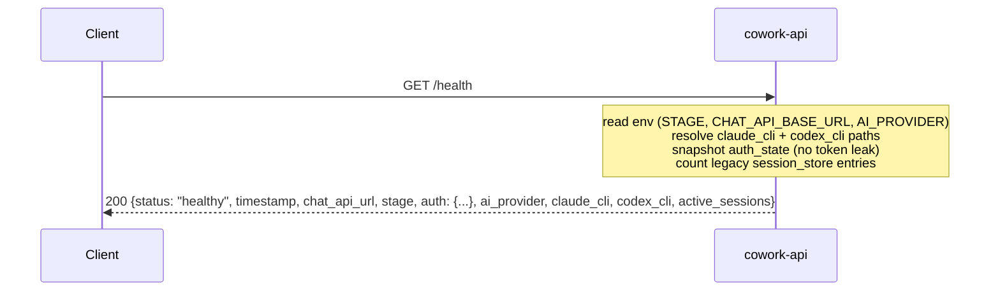
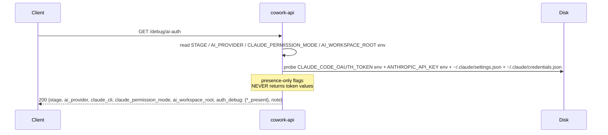
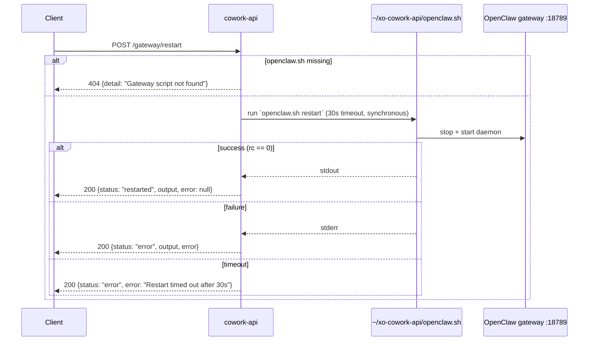
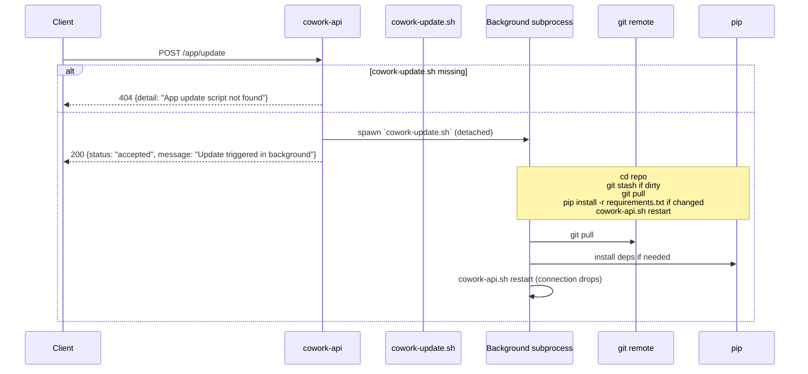

# Server / lifecycle API — frontend integration guide

For frontends that need to inspect server health, manage the underlying process / OpenClaw gateway, or interact with the legacy session_store. These all live at the **root** of the FastAPI app (no `/api/` prefix) and aren't part of the cowork_agent surface — they're for ops, debugging, and self-management.

**Base URL:** `http://${HOST:-localhost}:${PORT:-5002}`
**Auth:** none required at this surface.

---

## At a glance

**Info / health**

| Endpoint | Purpose |
|---|---|
| `GET /` | `{status: "XO Cowork API running"}` |
| `GET /health` | Health snapshot: chat URL, stage, auth, providers, sessions |
| `GET /debug/ai-auth` | Redacted AI auth-config snapshot |

**Legacy `session_store` (pre `xo-projects`)**

| Endpoint | Purpose |
|---|---|
| `GET /sessions` | Legacy in-memory `project_name → session_id` map |
| `DELETE /sessions/{project_id}` | Clear a legacy session |

**Lifecycle (process + gateway management)**

| Endpoint | Purpose |
|---|---|
| `POST /gateway/restart` | Restart the OpenClaw gateway (synchronous) |
| `POST /app/restart` | Restart cowork-api itself (background) |
| `POST /app/update` | `git pull` + restart (background) |

> [!WARNING]
> `POST /app/restart` and `POST /app/update` will tear down the current FastAPI process. In-flight SSE streams disconnect; the frontend must surface a "server restarting" state and retry `/health` until it returns 200.

These are deliberately separate from the chat / agent / files / connectors surfaces. They have nothing to do with multi-tenant project state — they're about THIS specific cowork-api process and its child OpenClaw gateway.

---

## 1. `GET /` — root

Bare existence check. The simplest possible "server is up" probe.

### Response (200)

```json
{ "status": "XO Cowork API running" }
```

That's the entire payload. No auth check, no version, no timestamp. Use `/health` if you want anything more useful.

---

## 2. `GET /health`



Detailed health snapshot. Read on app boot to verify the server is configured and authenticated.

### Response (200)

```jsonc
{
  "status":          "healthy",                                     // always "healthy" if reached
  "timestamp":       "2026-05-10T12:34:56.789012",                  // ISO 8601, no timezone suffix
  "chat_api_url":    "https://api-swarm-beta.xo.builders",          // CHAT_API_BASE_URL env var
  "stage":           "beta",                                         // "beta" | "local" (STAGE env var)
  "auth": {
    "authenticated":   true,
    "user_id":         "user_2bX9aB7cdEfGhI",
    "expires_at":      "2026-05-10T13:34:56+00:00",
    "auth_session_id": "as_2bX9aB7c...",
    "token_source":    "session"                                     // "session" | "api_key" | "none"
  },
  "ai_provider":     "claude",                                       // AI_PROVIDER env var (legacy /ask_question* path)
  "claude_cli":      "/Users/me/.local/bin/claude",                  // resolved path (or "claude" if relying on PATH)
  "codex_cli":       "/Users/me/.local/bin/codex",                   // ditto
  "active_sessions": 4                                                // size of legacy session_store dict
}
```

### Behavior

- `status` is always `"healthy"` if the response comes back at all. If the server is broken, you won't get a 200 from `/health` — TCP connect fails or the request hangs.
- `auth` is the same `get_auth_state()` snapshot as `/xo-auth/state`.
- `active_sessions` is the **legacy** session_store count (used by `/ask_question*` flow). It does NOT include `/api/chat/*` sessions — for those, count entries in `/api/sessions`.
- `claude_cli` and `codex_cli` show the resolved binary paths after STAGE-aware resolution. On `STAGE=local` they're auto-discovered via `shutil.which`; on `STAGE=beta` they're hardcoded `/home/coder/.local/bin/...`.

### Frontend usage

```typescript
async function bootHealthCheck() {
  try {
    const h = await fetch("/health").then(r => r.json());
    if (!h.auth.authenticated) {
      // Kick off /xo-auth flow
    }
    if (h.stage !== "beta") {
      // Show "local-dev" indicator
    }
    return h;
  } catch (e) {
    showOfflineBanner();
    throw e;
  }
}
```

---

## 3. `GET /debug/ai-auth`



Redacted snapshot of AI provider auth configuration. For diagnosis when the legacy `/ask_question*` flow misbehaves.

### Response (200)

```jsonc
{
  "stage":                  "beta",
  "ai_provider":            "claude",
  "claude_cli":             "/Users/me/.local/bin/claude",
  "claude_permission_mode": "bypassPermissions",
  "ai_workspace_root":      "/home/coder",
  "auth_debug": {
    "claude_oauth_token_present":      true,
    "anthropic_api_key_present":       false,
    "claude_settings_json_present":    true,
    "claude_credentials_json_present": true
    // ... best-effort indicators about what the claude CLI will see
  },
  "note": "Secrets are never returned. This is a best-effort hint based on server env; CLI internals may apply their own precedence."
}
```

The `auth_debug` block has presence-only flags — never the actual token values. Useful when figuring out why `claude` is using one identity vs another.

This endpoint is only relevant to the **legacy** `/ask_question*` flow. The new `/api/chat/*` adapter pipeline doesn't go through this code path.

---

## 4. `GET /sessions` (legacy)

The in-memory `session_store` dict from the `/ask_question*` flow. Maps `project_name` → `session_id`.

### Response (200)

```jsonc
{
  "sessions": {
    "my-project":      "9d4e5f6a-1234-...",
    "another-project": "5b3c2a1d-...",
  },
  "count": 2
}
```

If no legacy sessions exist (i.e., `/ask_question*` was never called):

```jsonc
{ "sessions": {}, "count": 0 }
```

**Don't confuse this with `/api/sessions`** — that one (under [`frontend-sessions-messages-api.md`](frontend-sessions-messages-api.md)) reads from the on-disk xo-projects + openclaw indexes and is the canonical session list. The bare `/sessions` endpoint is purely the legacy in-memory map.

---

## 5. `DELETE /sessions/{project_id}` (legacy)

Clear a single legacy session entry.

### Path parameter

`project_id` — the `project_name` key from `/sessions`.

### Response (200) — success

```jsonc
{
  "success": true,
  "message": "Session cleared for my-project"
}
```

### Response (200) — not found

```jsonc
{
  "success": false,
  "message": "No session found for my-project"
}
```

Note: returns 200 even on miss; check `success` field. There is no 404 for this endpoint.

---

## 6. `POST /gateway/restart`



Restart the OpenClaw gateway (the daemon at port `:18789` that serves the OpenAI-compatible HTTP endpoint).

### Request body

Empty.

### Behavior

```
1. Locate ~/xo-cowork-api/openclaw.sh.
2. Run `openclaw.sh restart` synchronously with a 30-second timeout.
3. Return the script's exit code, stdout, and stderr.
```

This is **synchronous** — the request blocks until the script returns or times out.

### Response (200)

```jsonc
// Restart succeeded (returncode == 0)
{
  "status": "restarted",
  "output": "openclaw gateway restarted on :18789\n",      // stdout
  "error":  null
}

// Restart failed (returncode != 0)
{
  "status": "error",
  "output": "...stdout...",
  "error":  "openclaw: gateway not found in PATH\n"        // stderr
}

// Timeout
{ "status": "error", "error": "Restart timed out after 30s" }
```

### Errors

```
404: {"detail": "Gateway script not found"}
500: {"detail": {"error": "<exception>"}}
```

The script lookup hardcodes `~/xo-cowork-api/openclaw.sh` — if the repo lives elsewhere the endpoint 404s. Frontends should fall back to manual instructions in that case.

### When to call

- After `POST /api/channels/add` when `restart_required: true` came back
- After `PUT /api/secrets/env` if a key the gateway uses changed
- When `/api/channels/openclaw/status` returns `running: false` and you want to retry

---

## 7. `POST /app/restart`

```mermaid
sequenceDiagram
  participant C as Client
  participant A as cowork-api
  participant SH as cowork-api.sh
  participant BG as Background subprocess
  C->>A: POST /app/restart
  alt cowork-api.sh missing
    A-->>C: 404 {detail: "App restart script not found"}
  else
    A->>BG: spawn `cowork-api.sh restart` (detached)
    A-->>C: 200 {status: "accepted", message: "Restart triggered in background"}
    Note over A,BG: a moment later the script kills + relaunches the API,<br/>HTTP connection drops; frontend polls /health
    BG->>SH: kill old PID + relaunch
  end
```

Restart the cowork-api process itself. Runs `cowork-api.sh restart` in the **background** (the response returns immediately while the script kills + relaunches the API).

### Request body

Empty.

### Response (200)

```jsonc
{
  "status":  "accepted",
  "message": "Restart triggered in background"
}
```

The HTTP connection is dropped a moment later as the API kills itself. The frontend should expect to lose its connection and reconnect.

### Errors

```
404: {"detail": "App restart script not found"}
500: {"detail": {"error": "<exception>"}}
```

### Frontend example

```typescript
async function restartCoworkApi() {
  await fetch("/app/restart", { method: "POST" });
  showRestartingBanner();

  // Poll for the server to come back up
  const startedAt = Date.now();
  while (Date.now() - startedAt < 30000) {
    await new Promise(r => setTimeout(r, 1000));
    try {
      const h = await fetch("/health").then(r => r.json());
      if (h.status === "healthy") {
        hideRestartingBanner();
        return;
      }
    } catch {
      // Still down; keep polling
    }
  }
  showRestartFailedBanner();
}
```

---

## 8. `POST /app/update`



Pull the latest code from git and restart. Runs `cowork-update.sh` in the background.

### Request body

Empty.

### Response (200)

```jsonc
{
  "status":  "accepted",
  "message": "Update triggered in background"
}
```

The script does:

```
1. cd to the repo
2. git pull (preserves uncommitted changes via `git stash` if needed)
3. pip install -r requirements.txt (if requirements changed)
4. cowork-api.sh restart
```

The HTTP connection drops mid-restart. Frontends should poll `/health` to detect when the server is back.

### Errors

```
404: {"detail": "App update script not found"}
500: {"detail": {"error": "<exception>"}}
```

### When to call

- User clicks "Check for updates" / "Update available"
- A `/health` response shows a stale version (when version reporting is added — currently not in the response shape)

This endpoint is destructive in that it changes the running code. Frontends should confirm before calling. There is no rollback button — if the update breaks things, the user fixes it via terminal.

---

## 9. Quick reference

```
GET    /                            simplest possible "alive" check
GET    /health                      detailed health (chat URL, stage, auth, sessions count)
GET    /debug/ai-auth               redacted AI auth config (legacy /ask_question* flow)

GET    /sessions                    legacy in-memory project_name → session_id map
DELETE /sessions/{project_id}       clear a legacy session entry

POST   /gateway/restart              synchronous OpenClaw gateway restart (30s timeout)
POST   /app/restart                  background cowork-api process restart
POST   /app/update                   background git pull + cowork-api restart
```

### Restart decision tree

```
something broke?
  ├─ in /api/chat/* response?
  │    OpenClaw-related → POST /gateway/restart
  │    cowork-api-related → POST /app/restart
  ├─ stale code? → POST /app/update (gets latest + restart in one step)
  └─ legacy session got stuck? → DELETE /sessions/{project_id}
```

### Health-check polling pattern

```typescript
// After any restart endpoint call
async function waitForServer(timeoutMs = 30000) {
  const start = Date.now();
  while (Date.now() - start < timeoutMs) {
    try {
      const r = await fetch("/health");
      if (r.ok) return await r.json();
    } catch { /* still down */ }
    await new Promise(r => setTimeout(r, 1000));
  }
  throw new Error("Server did not come back within timeout");
}
```
