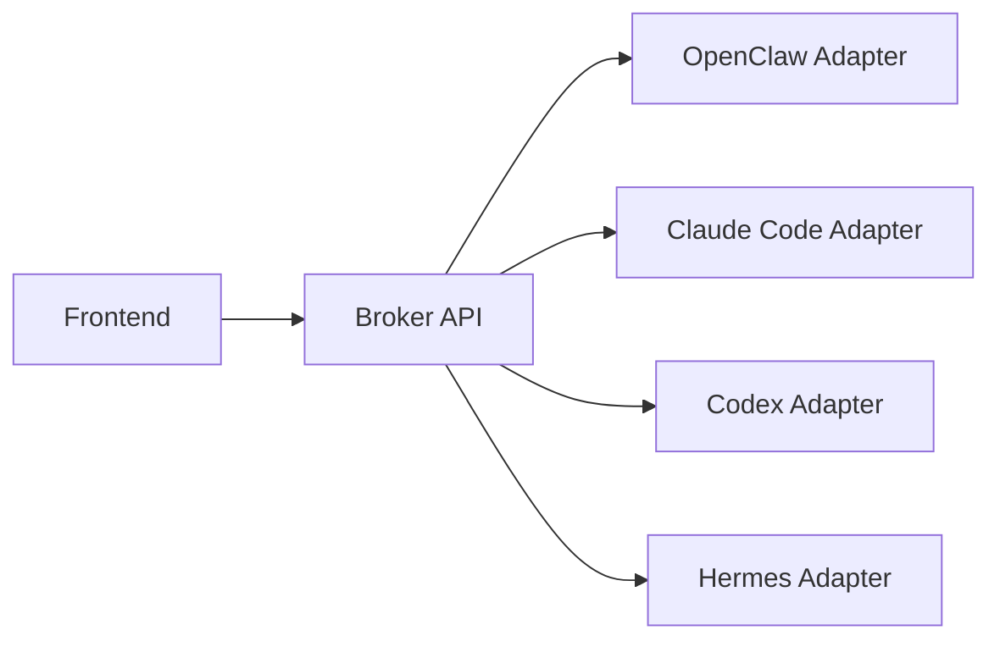
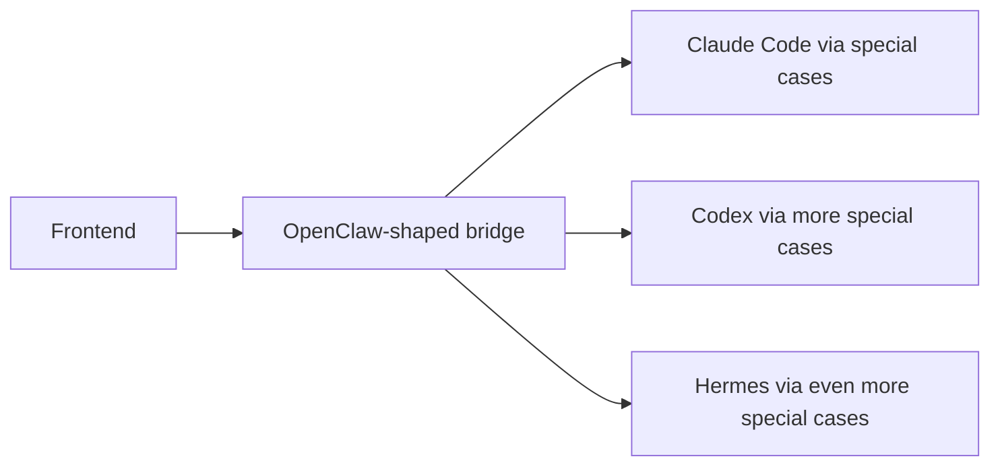
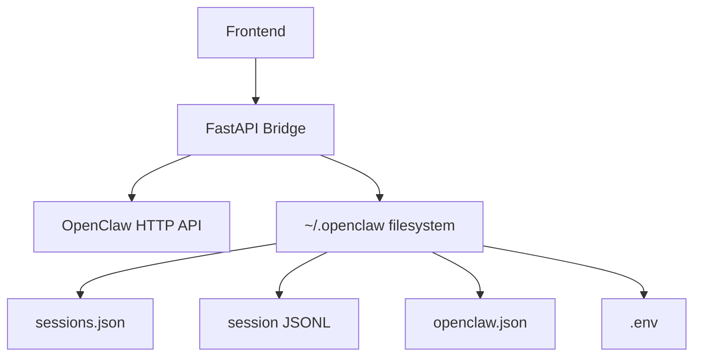
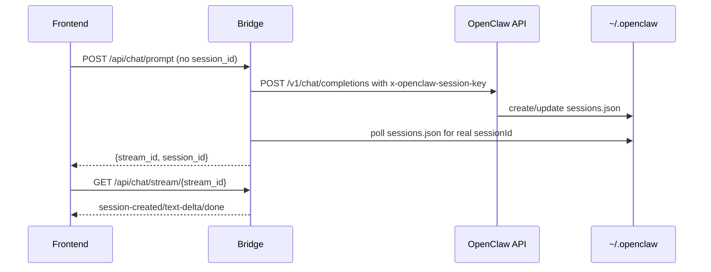
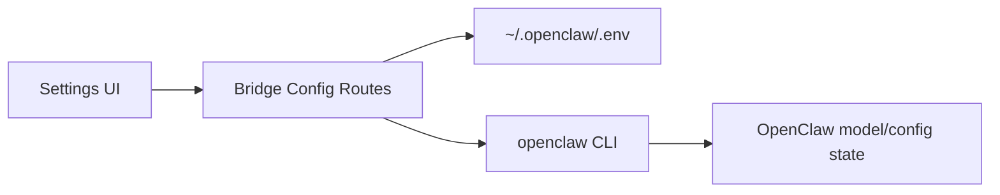
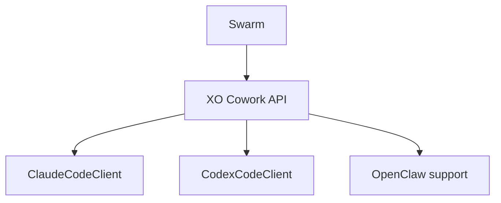
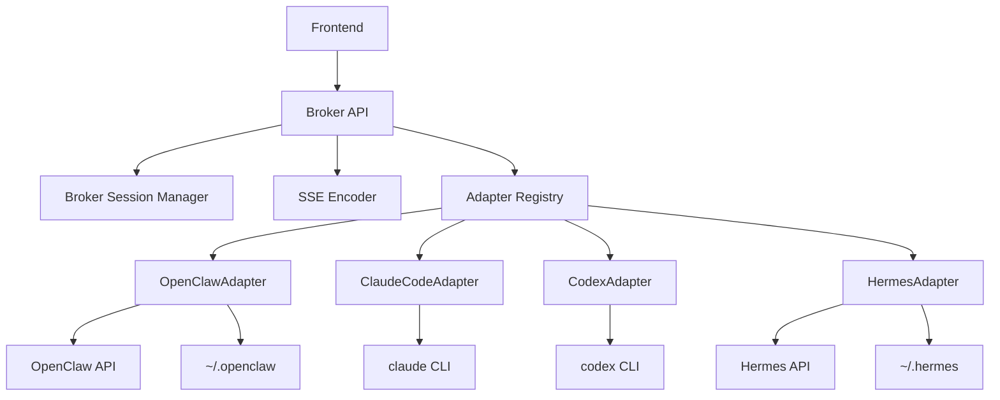
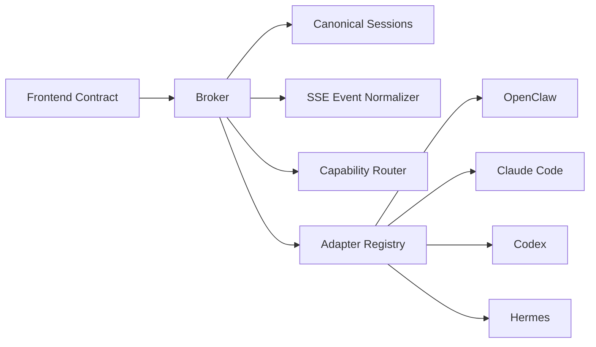

# Bridge Generalization Research

## Purpose

This document explains how the current `xo-cowork/bridge` works, why it is
structurally OpenClaw-specific, and how to generalize it into a runtime-agnostic
broker that can support:

- OpenClaw
- Claude Code
- Codex
- Hermes
- future runtimes with similar execution models

This is meant to be a study/reference document, not a lightweight note.

---

## 1. Executive Summary

The current bridge is **not** a generic cowork broker with an OpenClaw adapter.
It is an **OpenClaw adapter that also happens to satisfy the frontend’s main
chat/session contract**.

That distinction matters.

### Current reality

The bridge currently assumes:

- OpenClaw is the runtime
- OpenClaw owns session identity
- OpenClaw owns local persistence
- OpenClaw agent directories are the model catalog
- OpenClaw CLI/config is the onboarding mechanism
- OpenClaw JSONL is the source for usage analytics

### Correct direction

The right path is to evolve the bridge into:



Not this:



### Bottom line

Generalization should mean:

1. preserve the frontend contract
2. move runtime-specific logic behind adapters
3. move canonical session identity into the broker
4. treat transport, state, config, and usage as separate concerns

---

## 2. What The Current Bridge Actually Is

The present `xo-cowork/bridge` is a FastAPI backend that:

- receives chat/session/config/files requests from the frontend
- reads local OpenClaw state under `~/.openclaw`
- proxies chat turns to OpenClaw’s OpenAI-compatible HTTP API
- discovers sessions via OpenClaw session files
- emits frontend-facing SSE events
- mutates OpenClaw config/env files for onboarding

### Simplified current architecture



### Main implication

The bridge does not just “integrate with OpenClaw.” It is organized around
OpenClaw as its storage model, runtime model, config model, and session model.

---

## 3. Where OpenClaw Is Hard-Coded

This section isolates the exact architectural assumptions that prevent easy
generalization.

## 3.1 Chat execution

### Current behavior

`bridge/routes/chat.py` and `bridge/streaming.py` assume:

- one upstream chat URL: `OPENCLAW_API_URL`
- one auth header pattern: `Bearer {OPENCLAW_API_KEY}`
- one runtime continuation header: `x-openclaw-session-key`
- one default model shape: `OPENCLAW_MODEL`
- one response chunk format: OpenAI-compatible `choices[].delta.content`

### Current new-session flow



### Why this is not generic

This assumes the runtime:

- accepts an external session key
- materializes session state to disk quickly
- can be polled through a local session index

Claude Code and Codex do not naturally work this way. Hermes works differently
again.

---

## 3.2 Session storage and lookup

### Current assumption

`bridge/sessions_io.py` assumes session truth is discoverable by walking:

- `~/.openclaw/agents/*/sessions/sessions.json`
- `~/.openclaw/agents/*/sessions/{id}.jsonl`

### Current lookup contract

| Need | Current source |
|---|---|
| session list | `sessions.json` |
| session title | derive from JSONL |
| continuation key | reverse-lookup in `sessions.json` |
| transcript/messages | parse JSONL |
| workspace directory | read from session meta |

### Why this breaks generalization

| Runtime | Native state model | Compatible with current session layer? |
|---|---|---|
| OpenClaw | `sessions.json` + JSONL | Yes |
| Claude Code | native resume/session ids | No |
| Codex | native thread ids | No |
| Hermes | JSON files in `~/.hermes/sessions/` | No |

The current bridge treats runtime-native storage as broker storage. That is the
wrong abstraction boundary.

---

## 3.3 Agent management

### Current assumption

`bridge/routes/agents.py` and `bridge/openclaw_store.py` assume:

- the agent catalog lives in `openclaw.json`
- each agent has a directory under `~/.openclaw/agents/{id}/`
- agent metadata and workspace paths are OpenClaw config concerns

### Current meaning of “agent”

Right now, “agent” in the bridge mostly means:

- an OpenClaw agent entry
- backed by OpenClaw disk layout
- surfaced to the UI in a generic-looking format

### Why that matters

Claude Code and Codex do not need OpenClaw-style agent directories to exist.
Hermes has a different state model and could expose channels/sessions/skills
without any equivalent to `openclaw.json`.

---

## 3.4 Model catalog

### Current behavior

`/api/models` is built by synthesizing one model row per OpenClaw agent:

| Output field | Current source |
|---|---|
| `id` | `openclaw/{agentId}` |
| `provider_id` | `"openclaw"` |
| `metadata.openclaw_agent_id` | agent directory name |
| capabilities | static OpenClaw capability map |

### What this really is

The route is not a provider/model registry. It is an OpenClaw agent listing
shaped like a model registry.

### Why that is a structural blocker

A real generalized broker will need:

- runtime ids
- provider ids
- possibly multiple runtimes in one workspace
- capability-based filtering
- possibly both “runtime target” and “model choice”

The current model API cannot express that cleanly.

---

## 3.5 Provider onboarding and configuration

### Current behavior

`bridge/routes/config_routes.py` does provider onboarding by:

1. writing keys into `~/.openclaw/.env`
2. running fixed OpenClaw CLI commands such as `openclaw models set ...`
3. logging to `~/.openclaw/bridge-provisioning.log`

### Current model



### Why this is wrong for a generic broker

| Runtime | Config surface |
|---|---|
| OpenClaw | `.env` + `openclaw.json` + OpenClaw CLI |
| Claude Code | OAuth/token/env + CLI invocation |
| Codex | OpenAI/Codex auth + CLI invocation |
| Hermes | `.env` + `config.yaml` + `auth.json` + Hermes CLI |

The broker should own a provider/runtime registry, not force all onboarding
through OpenClaw’s CLI.

---

## 3.6 Usage tracking

### Current behavior

`/api/usage` works by walking OpenClaw session JSONL and aggregating:

- tokens
- cost
- latency
- model/provider stats

### Why that is runtime-specific

Usage derives from OpenClaw’s persisted assistant records. That means:

- it is local
- it is retrospective
- it is OpenClaw-shaped

### Generalized requirement

A generalized broker needs one of:

| Strategy | Works for |
|---|---|
| runtime-native scan | OpenClaw, Hermes if local data exists |
| broker-captured usage telemetry | Claude Code, Codex |
| platform-level centralized metering | full future system |

The current bridge only implements the first strategy.

---

## 3.7 Status, diagnostics, and optional surfaces

Some routes already hint at broader ambitions, but remain OpenClaw-biased:

| Route/surface | Current reality |
|---|---|
| `/api/channels/openclaw/status` | real OpenClaw health probe |
| `/api/codex/status` | Codex accounts inferred from OpenClaw auth data |
| `/api/connectors`, `/api/plugins`, `/api/skills` | mostly stubs |
| `/api/workspace-memory`, `/api/fts` | stubs |

This means even “multi-runtime” hints are still passing through OpenClaw’s
state model.

---

## 4. What Is Reusable

The bridge is not a rewrite candidate. Several layers are good and should be
preserved.

## 4.1 Reusable layers

| Layer | Reusable? | Notes |
|---|---|---|
| FastAPI router structure | Yes | clean modular route organization |
| SSE HTTP response framing | Yes | can stay broker-level |
| request parsing / validation style | Yes | useful across adapters |
| file operations | Mostly | workspace file ops are runtime-agnostic enough |
| `active_streams` pattern | Yes | can evolve into stream/session manager |
| frontend route contract | Yes | important to preserve |

## 4.2 Non-reusable assumptions

| Layer | Why it must change |
|---|---|
| chat runtime code | OpenClaw headers/URLs/chunk shape |
| session store | OpenClaw filesystem assumptions |
| model list | OpenClaw agent directories masquerading as models |
| config onboarding | OpenClaw CLI/env assumptions |
| usage | OpenClaw JSONL only |
| agent CRUD semantics | tied to `openclaw.json` |

---

## 5. Strongest Design Guidance From The Docs

Two internal-docs patterns provide the right generalization model.

## 5.1 XO Cowork API docs

The docs describe `xo-cowork-api` as:

- a workspace-local FastAPI broker
- provider-agnostic
- built around provider clients
- maintaining stable API sessions even when runtimes differ
- wrapping Claude Code and Codex CLIs behind one API

### Intended shape



That is a broker-with-clients model, not a runtime-filesystem model.

## 5.2 Paperclip adapter registry

The research docs define explicit adapter types such as:

- `claude_local`
- `codex_local`
- `openclaw_gateway`
- `hermes_local`
- `process`
- `http`

### Why this matters

It gives us the missing abstraction vocabulary:

- runtime adapter
- transport type
- session capability
- fallback generic adapter

That is the cleanest bridge-generalization pattern available in the docs.

---

## 6. Recommended Target Architecture

## 6.1 High-level design



---

## 6.2 Core broker responsibilities

The generalized bridge should own:

| Broker responsibility | Description |
|---|---|
| canonical session ids | frontend-stable session identity |
| adapter lookup | choose runtime by request / workspace / config |
| SSE normalization | one frontend event model |
| capability routing | expose optional features only where supported |
| local broker state | minimal persistent registry independent of runtime |

The broker should **not** own:

| Not broker-owned | Why |
|---|---|
| OpenClaw-specific session format | runtime concern |
| Hermes config layout | runtime concern |
| Claude Code CLI command structure | adapter concern |
| Codex thread semantics | adapter concern |

---

## 6.3 Runtime adapter interface

The bridge should depend on a runtime protocol rather than OpenClaw helpers.

```python
class RuntimeAdapter(Protocol):
    id: str

    async def list_models(self) -> list[dict]: ...
    async def create_session(self, request: PromptRequest) -> SessionStartResult: ...
    async def resume_session(self, session: BrokerSession, request: PromptRequest) -> StreamHandle: ...
    async def list_sessions(self, limit: int, offset: int) -> list[SessionRecord]: ...
    async def get_session(self, session_id: str) -> SessionRecord | None: ...
    async def get_messages(self, session_id: str, limit: int, offset: int) -> list[MessageRecord]: ...
    async def get_usage(self, params: UsageParams) -> UsageResult | None: ...
    async def get_status(self) -> dict: ...
```

### Recommended concrete adapters

| Adapter | Purpose |
|---|---|
| `OpenClawAdapter` | current runtime preserved behind interface |
| `ClaudeCodeAdapter` | subprocess-based coding runtime |
| `CodexAdapter` | subprocess-based coding runtime |
| `HermesAdapter` | HTTP + local-state runtime |
| `ProcessAdapter` | generic fallback |
| `HttpAdapter` | generic HTTP runtime fallback |

---

## 6.4 Broker-owned canonical session model

This is the most important architectural change.

### Problem today

The bridge lets OpenClaw define session identity.

### Correct future model

```json
{
  "id": "xo_session_uuid",
  "runtime": "claude_code",
  "native_session_id": "provider_thread_or_conversation_id",
  "native_session_key": null,
  "workspace": "/home/coder/project",
  "agent_id": "main",
  "title": "Fix the auth bug",
  "time_created": "2026-04-21T12:00:00Z",
  "time_updated": "2026-04-21T12:10:00Z",
  "metadata": {}
}
```

### Why this matters

| Runtime | Native identity | Broker should expose |
|---|---|---|
| OpenClaw | session key + sessionId | canonical `xo_session_uuid` |
| Claude Code | resume/conversation id | canonical `xo_session_uuid` |
| Codex | thread id | canonical `xo_session_uuid` |
| Hermes | Hermes session id | canonical `xo_session_uuid` |

The frontend should only care about broker session ids.

---

## 6.5 Separate transport from state

Today the bridge bundles too many concerns together.

These should be split.

### Transport strategies

| Transport strategy | Used by |
|---|---|
| OpenAI-compatible HTTP stream | OpenClaw, Hermes |
| subprocess streaming | Claude Code, Codex |
| buffered subprocess | runtimes without usable stream output |
| upstream SSE relay | future runtime classes |

### State providers

| State provider | Used by |
|---|---|
| OpenClaw state provider | OpenClaw |
| Hermes state provider | Hermes |
| broker session store | Claude Code, Codex |
| hybrid provider | future runtimes |

This is the clean separation the current code lacks.

---

## 6.6 Capability-driven surfaces

Not every runtime supports every feature.

The broker should expose runtime capabilities explicitly:

| Capability | Meaning |
|---|---|
| `native_sessions` | runtime has its own resumable session IDs |
| `session_listing` | runtime can list past sessions/messages |
| `messaging_gateway` | runtime can run external channel listeners |
| `local_usage_scan` | runtime persists usage locally for scan-based analytics |
| `skills` | runtime supports broker-visible skill toggles |
| `agent_directories` | runtime has a native agent catalog/directory model |

### Example matrix

| Runtime | native_sessions | session_listing | messaging_gateway | local_usage_scan | agent_directories |
|---|---:|---:|---:|---:|---:|
| OpenClaw | yes | yes | yes | yes | yes |
| Claude Code | yes | maybe broker-owned | no native equivalent | no | no |
| Codex | yes | maybe broker-owned | no native equivalent | no | no |
| Hermes | yes | yes | yes | maybe | no OpenClaw-style equivalent |

This prevents the broker from forcing one runtime’s worldview onto all others.

---

## 7. Per-Runtime Feasibility

## 7.1 OpenClaw

### Good fit for adapter extraction

OpenClaw already works through:

- OpenAI-compatible HTTP transport
- disk-backed session state
- agent directories
- local config/env
- built-in messaging gateway

### Recommendation

Keep behavior intact, but isolate it behind:

- `OpenClawAdapter`
- `OpenClawStateProvider`
- `OpenClawConfigService`

OpenClaw should become one adapter, not the architecture baseline.

---

## 7.2 Claude Code

### Docs-grounded target model

The docs already describe Claude Code as a CLI runtime wrapped by cowork.

### Likely adapter shape

| Concern | Design |
|---|---|
| execution | spawn `claude` CLI |
| streaming | parse stream-json |
| session continuity | native Claude resume/session ids |
| persistence | broker-owned session registry |
| auth | Claude token/session handling |

### Main refactor pressure

Claude Code forces the bridge to stop depending on:

- filesystem-based session discovery
- OpenClaw agent directories
- OpenClaw config/env semantics

This is why it should be the first non-OpenClaw adapter.

---

## 7.3 Codex

### Similarity to Claude Code

Codex should follow the same architectural pattern:

| Concern | Design |
|---|---|
| execution | spawn `codex` CLI |
| streaming | parse JSON/stream output |
| session continuity | native thread ids |
| persistence | broker-owned session registry |
| auth | OpenAI/Codex auth path |

### Recommendation

Implement after Claude Code. Most of the orchestration machinery should be
shared.

---

## 7.4 Hermes

Hermes is especially useful because it validates the transport/state split.

### What the docs say Hermes has

| Surface | Hermes docs |
|---|---|
| HTTP API | `/v1/chat/completions` |
| session continuity | Hermes session header |
| local state | `~/.hermes` |
| session files | JSON files |
| config | `config.yaml` + `.env` + `auth.json` |
| messaging | `hermes gateway ...` commands |
| skills | native skill system |

### Key insight

Hermes can likely share **transport infrastructure** with OpenClaw, because both
offer OpenAI-compatible HTTP chat APIs.

But Hermes cannot share **state/config assumptions** with OpenClaw.

### Recommendation

Hermes should be:

- its own adapter
- likely using a shared HTTP transport helper
- backed by a Hermes-specific state/config provider

---

## 8. Refactor Plan

## Phase 1: Extract OpenClaw behind interfaces

Goal:

- no behavior change
- pure dependency inversion

Actions:

- create `OpenClawAdapter`
- create `OpenClawSessionStore`
- create `OpenClawConfigService`
- keep existing routes, but route them through broker service boundaries

## Phase 2: Introduce broker-owned sessions

Goal:

- stop binding frontend session ids to runtime-native ids

Actions:

- add broker session registry
- map canonical session ids to native ids/keys
- start using it even for OpenClaw

## Phase 3: Split model/config/status surfaces

Goal:

- remove OpenClaw as the universal settings model

Actions:

- `/api/models` becomes broker/runtime aggregated
- `/api/config/providers` becomes provider/runtime registry output
- `/api/channels/*` becomes capability-based
- `/api/usage` becomes adapter-aware

## Phase 4: Implement Claude Code adapter

Goal:

- prove broker-owned sessions and subprocess runtime orchestration

Why first:

- strongest docs support
- most important non-OpenClaw runtime
- forces the right abstractions

## Phase 5: Implement Codex adapter

Goal:

- reuse Claude subprocess/session architecture

## Phase 6: Implement Hermes adapter

Goal:

- validate shared HTTP transport + separate state provider approach

---

## 9. What Not To Do

Avoid these anti-patterns:

| Anti-pattern | Why it is bad |
|---|---|
| represent Claude/Codex/Hermes as fake OpenClaw agents | wrong state model, wrong semantics |
| keep `/api/models` as “OpenClaw agents as models” | blocks real provider/runtime discovery |
| keep all credentials in `~/.openclaw/.env` | runtime-coupled config leakage |
| tie frontend sessions to runtime-native ids | breaks broker abstraction |
| hard-code all onboarding through OpenClaw CLI | impossible to scale cleanly |

---

## 10. Recommended Mental Model

The bridge should stop thinking in terms of:

- OpenClaw directories
- OpenClaw session keys
- OpenClaw agent ids
- OpenClaw config files

and start thinking in terms of:

- broker sessions
- adapter registry
- transport strategies
- state providers
- capabilities

### Correct future shape



---

## 11. Final Conclusion

Yes: the current bridge is fundamentally OpenClaw-specific.

The most important truth is this:

> The bridge should generalize by becoming a broker with adapters, not by
> becoming a bigger OpenClaw-shaped codebase with more exceptions.

The correct path is:

1. keep the current frontend API stable
2. extract OpenClaw behind an adapter
3. move canonical session state into the broker
4. implement Claude Code and Codex through subprocess adapters
5. implement Hermes through a dedicated HTTP/state adapter

If done correctly:

- OpenClaw and Hermes can share transport helpers
- Claude Code and Codex can share subprocess orchestration
- the broker remains the single stable API surface for the frontend
