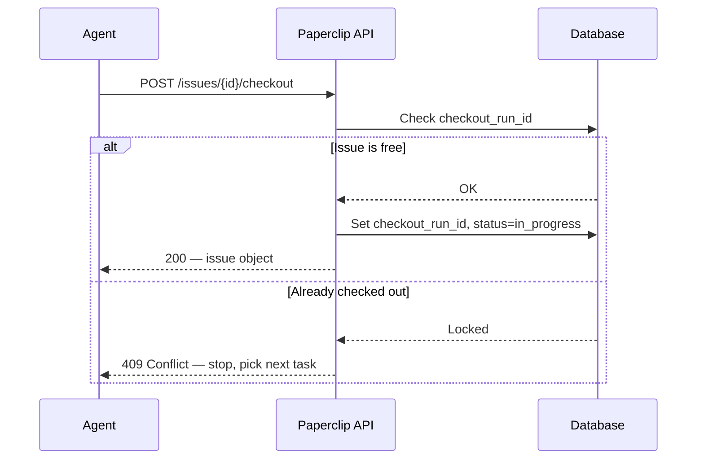
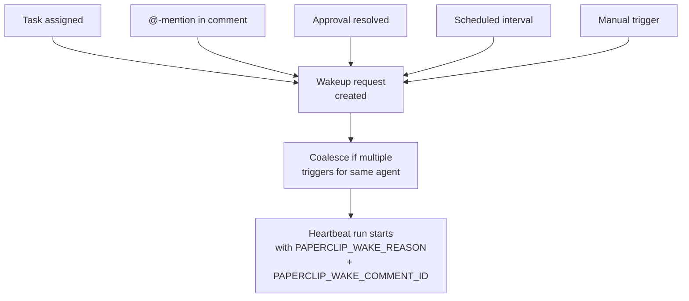

# Paperclip — Agent Execution

## The Heartbeat Model

Agents do not run continuously. They execute in **heartbeat runs** — short, stateless execution windows triggered periodically or on-demand. Each run follows a strict protocol:


Heartbeat runs are recorded in the `heartbeat_runs` table:

| Column | Description |
|---|---|
| `id` | Run UUID (used as `X-Paperclip-Run-Id` header) |
| `invocation_source` | `assignment`, `comment_mention`, `scheduled`, etc. |
| `status` | `running` → `completed` / `failed` |
| `context_snapshot` | JSON snapshot of environment at wake time |
| `usage_json` | Token counts and costs for this run |
| `result_json` | Final output/status |

## Checkout Protocol

Before touching any task, an agent **must checkout**. This ensures exclusive execution:



- Returns the issue object on success (status transitions to `in_progress`)
- Returns `409 Conflict` if another agent already holds the checkout — **never retry a 409**
- The lock is stored as `issues.checkout_run_id` + `execution_locked_at`

## Wakeup System

Agents are woken by the `agent_wakeup_requests` table:



| Trigger | Wake reason |
|---|---|
| New task assigned | `assignment` |
| Comment @-mention | `issue_comment_mentioned` |
| Approval resolved | `approval_resolved` |
| Scheduled heartbeat | `scheduled` |
| Manual trigger | `system` |

Wakeup requests are coalesced — if multiple triggers arrive for the same agent, they are batched into one run. The triggering comment ID is passed as `PAPERCLIP_WAKE_COMMENT_ID` so agents can respond precisely.

## Agent Configuration (`adapterConfig`)

Each agent's execution behaviour is controlled by JSONB stored in `agents.adapter_config`:

```json
{
  "cwd": "/home/coder/project",
  "graceSec": 30,
  "timeoutSec": 600,
  "maxTurnsPerRun": 50,
  "instructionsFilePath": "agents/rd/AGENTS.md",
  "instructionsBundleMode": "managed",
  "dangerouslySkipPermissions": false
}
```

## Execution Workspaces

Agents can be assigned isolated execution workspaces (git-backed directories):

```
~/.paperclip/instances/default/projects/{companyId}/{projectId}/{workspaceId}/
```

Workspace policy per issue is stored in `issues.execution_workspace_settings` (JSONB), allowing per-task overrides of the default workspace behavior.

## Runtime State Persistence

Cross-run state is maintained in `agent_runtime_state`:

| Column | Description |
|---|---|
| `total_input_tokens` | Cumulative input tokens across all runs |
| `total_output_tokens` | Cumulative output tokens |
| `total_cached_input_tokens` | Tokens served from cache |
| `total_cost_cents` | Lifetime cost |
| `last_error` | Most recent error message |

This allows cost dashboards and incident investigations to trace any agent's lifetime activity.

## Agent Instructions Files

Agents load their behavioral instructions from the filesystem. The resolved path is:

```
~/.paperclip/instances/default/companies/{companyId}/agents/{agentId}/instructions/
├── AGENTS.md          ← main entry point, loaded as instructionsFilePath
├── SOUL.md            ← persona, values, communication style
├── HEARTBEAT.md       ← step-by-step heartbeat checklist
└── TOOLS.md           ← available tool catalog
```

The `instructionsFilePath` in `adapter_config` points to the **entry file** (typically `AGENTS.md`). Relative paths are resolved against the agent's `cwd`; absolute paths are used as-is.

| File | On-disk path pattern | Purpose |
|---|---|---|
| `AGENTS.md` | `companies/{companyId}/agents/{agentId}/instructions/AGENTS.md` | Role-specific behavior, workflows, skill reference |
| `SOUL.md` | `companies/{companyId}/agents/{agentId}/instructions/SOUL.md` | Persona, values, communication style |
| `HEARTBEAT.md` | `companies/{companyId}/agents/{agentId}/instructions/HEARTBEAT.md` | Step-by-step heartbeat checklist |
| `TOOLS.md` | `companies/{companyId}/agents/{agentId}/instructions/TOOLS.md` | Available tool catalog |

The path is configured via `instructionsFilePath` and can be updated at runtime using `PATCH /api/agents/{agentId}/instructions-path`.

## Run Log Files

Each heartbeat run produces an NDJSON transcript at:

```
~/.paperclip/instances/default/data/run-logs/{companyId}/{agentId}/{runId}.ndjson
```

Each line is one event (tool call, model output, API request). These files are the primary audit trail for agent behaviour and are never deleted automatically.
