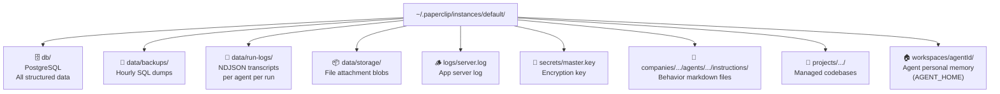

# Paperclip — Instance File Layout

A local Paperclip instance stores data across several directories under `~/.paperclip/instances/{name}/`. This page documents the full layout and the purpose of each location.

## Top-Level Structure

```
~/.paperclip/instances/default/
├── config.json                    ← instance configuration
├── db/                            ← embedded PostgreSQL data directory
├── data/
│   ├── backups/                   ← scheduled SQL backups
│   ├── run-logs/                  ← per-run NDJSON agent transcripts
│   └── storage/                   ← binary file attachments (local_disk provider)
├── logs/
│   └── server.log                 ← application server log
├── secrets/
│   └── master.key                 ← encryption key for secrets provider
├── companies/
│   └── {companyId}/
│       └── agents/
│           └── {agentId}/
│               └── instructions/  ← agent behavior markdown files
├── projects/
│   └── {companyId}/
│       └── {projectId}/
│           └── _default/          ← managed project codebase
└── workspaces/
    └── {agentId}/                 ← agent execution working directory
```

## config.json

The root instance configuration file. Controls:

- **Database** — embedded PostgreSQL port, data directory path
- **Storage** — provider (`local_disk` or `s3`), base path or S3 bucket
- **Secrets** — provider (`local_encrypted`), key file path
- **Server** — host, port, deployment mode, UI serving
- **Logging** — log mode and log directory
- **Backups** — interval, retention days, backup directory

```json
{
  "database": { "mode": "embedded-postgres", "embeddedPostgresPort": 54329 },
  "storage": { "provider": "local_disk" },
  "server": { "port": 3100, "deploymentMode": "local_trusted" }
}
```

## db/

Embedded PostgreSQL data directory. This is the **primary source of truth** for all structured data:

- Issues, comments, status history
- Agents, roles, permissions, chain-of-command
- Projects, goals, workspaces
- Run records and heartbeat metadata
- Documents and document revisions
- Approvals and approval decisions
- Skills and skill assignments
- Secrets (encrypted values)

The database is **not human-readable** from the filesystem — access it via the Paperclip REST API or directly via `psql` on the configured port.

## data/backups/

Scheduled SQL dumps of the PostgreSQL database.

| Property | Value |
|---|---|
| Frequency | Hourly |
| Retention | 30 days |
| Format | `paperclip-YYYYMMDD-HHMMSS.sql` |

Example: `paperclip-20260402-143712.sql`

## data/run-logs/

Per-agent-run NDJSON transcript files. Each heartbeat execution produces one file:

```
data/run-logs/
└── {companyId}/
    └── {agentId}/
        └── {runId}.ndjson
```

Each line in the NDJSON file is one event from the agent's execution (tool calls, outputs, API calls, etc.). These files are the audit trail for agent behavior.

## data/storage/

Binary blob storage for file attachments uploaded to issues. When the storage provider is `local_disk`, uploaded files are written here as opaque objects referenced by key. Currently empty on a fresh instance.

## logs/server.log

Application-level server log. Captures startup events, API request errors, heartbeat scheduling, and infrastructure warnings.

## secrets/master.key

The encryption key for the `local_encrypted` secrets provider. Company API keys and tokens are stored encrypted in PostgreSQL; this file is required to decrypt them at runtime.

<Callout type="warn">
  Back up `master.key` separately from the database. Losing it makes stored secrets permanently unrecoverable.
</Callout>

## Agent Instructions

**Agent instruction files** — markdown documents that define an agent's persona, responsibilities, and operating procedures. Loaded into the agent's context at the start of each heartbeat.

Typical files for a fully configured agent:

| File | Purpose |
|---|---|
| `AGENTS.md` | Main entry point — role summary, links to other files |
| `HEARTBEAT.md` | Step-by-step checklist for every execution run |
| `SOUL.md` | Persona, voice, strategic posture |
| `TOOLS.md` | Available tools and usage notes |

These files are **behavior**, not memory. They describe how the agent should act, not what it knows.

## Project Codebases

Managed codebase for each Paperclip project. When a project is created without an external `repoUrl`, Paperclip provisions this folder as the project's working directory.

Agents assigned to issues within that project execute with this folder as their working directory (`cwd`). Multiple workspaces per project are supported — each gets its own subfolder instead of `_default`.

Example contents of a scaffolded project:

```
_default/
├── src/
├── docs/
│   └── adr/
├── package.json
├── tsconfig.json
└── README.md
```

## Agent Workspaces

The **personal working directory** for each agent — used as `$AGENT_HOME`. Agents write files here during task execution: PARA knowledge graph, daily notes, plans, and any task output files.

```
workspaces/{agentId}/
├── MEMORY.md              ← tacit knowledge index
├── SOUL.md / HEARTBEAT.md ← (symlinked or copied from instructions, optional)
├── life/                  ← PARA knowledge graph
│   ├── index.md
│   ├── projects/
│   ├── areas/
│   │   ├── companies/
│   │   └── people/
│   ├── resources/
│   └── archives/
└── memory/
    └── YYYY-MM-DD.md      ← daily notes
```

Unlike `instructions/`, this directory is **writable by the agent** and accumulates knowledge across sessions.

## Claude Code Session State

When agents run via the `claude_local` adapter, Claude Code writes additional state to `~/.claude/`:

```
~/.claude/
├── settings.json                          ← Claude Code config and hooks
├── projects/
│   ├── {workspace-path-hash}/             ← conversation history per agent workspace
│   │   ├── memory/                        ← session memory files
│   │   └── *.jsonl                        ← conversation transcript
│   └── {project-path-hash}/              ← conversation history per project workspace
├── sessions/                              ← active session state
└── shell-snapshots/                       ← environment snapshots
```

Conversation transcripts are JSONL files, one per session. The `memory/` subfolder is where agents using the `para-memory-files` skill write their Claude Code-scoped memory (distinct from the PARA knowledge graph in `$AGENT_HOME/life/`).

## Storage at a Glance



## Summary Table

| Location | Stores | Writable by |
|---|---|---|
| `db/` | All structured data (source of truth) | Paperclip server only |
| `data/backups/` | SQL backups | Paperclip server (scheduled) |
| `data/run-logs/` | Agent run transcripts | Paperclip server |
| `data/storage/` | File attachment blobs | Paperclip server (on upload) |
| `secrets/master.key` | Encryption key | System admin |
| `companies/.../instructions/` | Agent behavior markdown | Admin / skills system |
| `projects/.../` | Project codebases | Agents during task execution |
| `workspaces/{agentId}/` | Agent personal memory + output | The agent itself |
| `~/.claude/` | Claude Code session state | Claude Code runtime |
