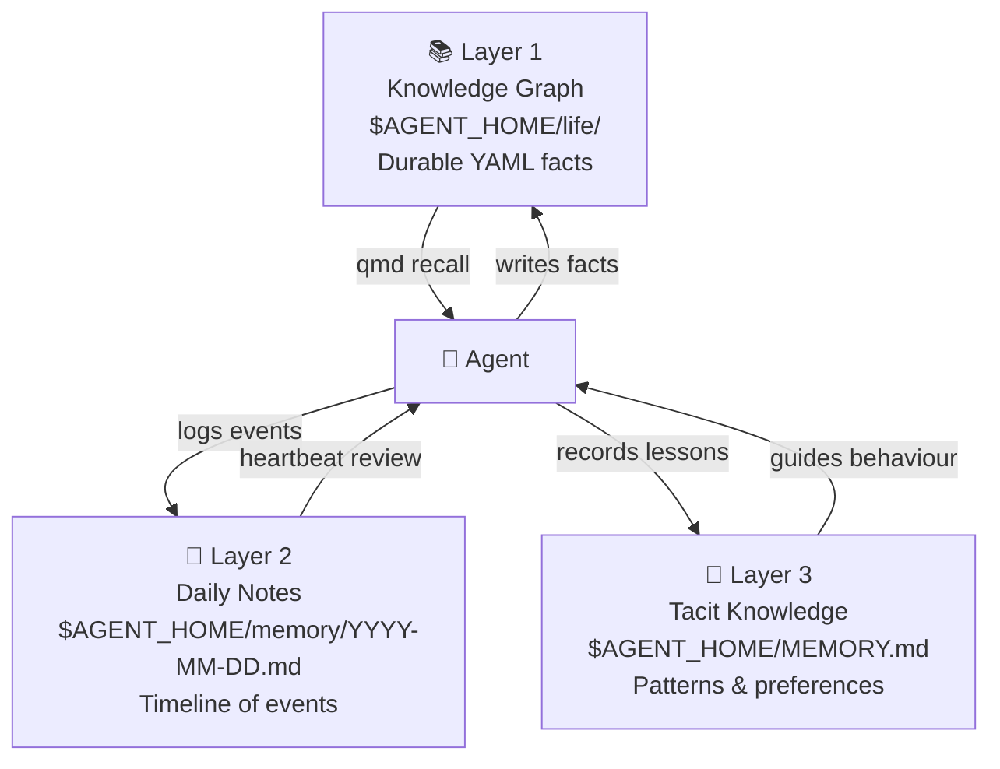

# Paperclip — Memory Architecture

Paperclip agents use a **three-layer memory system** based on the [PARA method](https://fortelabs.com/blog/para/) (Projects, Areas, Resources, Archive), managed through the `para-memory-files` skill.



## Layer 1: Knowledge Graph (PARA Folders)

Long-term, durable facts are stored as atomic YAML files in a PARA directory structure:

```
$AGENT_HOME/life/
  ├── Projects/          ← active project facts
  ├── Areas/             ← ongoing domain knowledge
  ├── Resources/         ← reference material
  └── Archive/           ← completed or stale facts
```

**Format:** Each file is a YAML fact with semantic metadata:

```yaml
entity: "Paperclip"
type: "platform"
fact: "Uses embedded PostgreSQL on port 54329"
confidence: high
last_verified: "2026-04-02"
```

Facts are accessed via the QMD (Query-Memory-Decode) recall pattern. Access timestamps are tracked, and a weekly synthesis job consolidates atomic facts into summaries.

## Layer 2: Daily Notes

Per-day Markdown files capture transient context — plans, decisions, blockers, and events:

```
$AGENT_HOME/memory/
  └── YYYY-MM-DD.md
```

**Structure of a daily note:**

```markdown
## Today's Plan
1. [HIGH] Complete PAP-6 research task
2. [MEDIUM] Review new agent hiring requests

## Timeline
- 09:00 Checked out PAP-6
- 09:15 Deep research on Paperclip storage begun
- 10:30 Draft complete, updating issue

## Blockers
(none today)
```

Daily notes are reviewed at the start of each heartbeat via the heartbeat checklist.

## Layer 3: Tacit Knowledge (Session State)

Runtime state that is not yet crystallized into long-term facts is stored in the database:

| Table | Purpose |
|---|---|
| `agent_task_sessions` | Per-task session parameters (`session_params_json`) |
| `agent_runtime_state` | Persistent cross-run state (token usage, last error, cost totals) |

Session-specific memory is also written to the filesystem:

```
~/.claude/projects/{absolute-cwd-hash}/memory/   ← Claude Code session memory files
~/.claude/projects/{absolute-cwd-hash}/*.jsonl    ← Conversation transcripts
~/.claude/session-env/                            ← Environment snapshots
```

The `{absolute-cwd-hash}` is a deterministic hash of the agent's working directory (`cwd`). Each agent workspace produces a unique hash, so session memories are scoped to the agent.

## Memory Operations

All memory reads and writes are mediated by the `para-memory-files` skill:

| Operation | Description |
|---|---|
| **Store fact** | Write a YAML atomic fact to the appropriate PARA folder |
| **Recall** | QMD pattern: query → match → decode to natural language |
| **Update** | Overwrite stale fact, increment version |
| **Synthesize** | Weekly job: compact many atomic facts → one summary file |
| **Decay** | Mark facts as stale after configurable TTL |

## Memory Scope

Memory is scoped by identity:

- **Agent-level** memory — stored in `$AGENT_HOME/` — persists across all tasks
- **Task-level** memory — stored in `agent_task_sessions` — scoped to one issue
- **Company-level** memory — shared facts in company skills or shared PARA folders

## File Reference: Where Every Memory File Lives

| File / Path | Layer | Stored in | Purpose |
|---|---|---|---|
| `~/.paperclip/instances/default/workspaces/{agentId}/MEMORY.md` | Layer 3 (tacit) | Disk | Tacit knowledge index — always-loaded pointer list |
| `~/.paperclip/instances/default/workspaces/{agentId}/life/Projects/` | Layer 1 | Disk | Active project YAML facts |
| `~/.paperclip/instances/default/workspaces/{agentId}/life/Areas/` | Layer 1 | Disk | Ongoing domain knowledge YAML facts |
| `~/.paperclip/instances/default/workspaces/{agentId}/life/Resources/` | Layer 1 | Disk | Reference material YAML facts |
| `~/.paperclip/instances/default/workspaces/{agentId}/life/Archive/` | Layer 1 | Disk | Stale/completed YAML facts |
| `~/.paperclip/instances/default/workspaces/{agentId}/memory/YYYY-MM-DD.md` | Layer 2 | Disk | Daily notes — plans, timeline, blockers |
| `~/.claude/projects/{cwd-hash}/memory/` | Layer 3 (session) | Disk | Claude Code session memory files |
| `~/.claude/projects/{cwd-hash}/*.jsonl` | Layer 3 (session) | Disk | Conversation transcripts |
| PostgreSQL `agent_task_sessions` | Layer 3 (DB) | Database | Per-task session params |
| PostgreSQL `agent_runtime_state` | Layer 3 (DB) | Database | Token counts, cost totals, last error |

`$AGENT_HOME` resolves to `~/.paperclip/instances/default/workspaces/{agentId}/`.

## Why PARA?

Tiago Forte's PARA method was chosen because:

1. **Low cognitive overhead** — four categories cover all knowledge types
2. **Action-oriented** — information is organized by how it will be used, not by type
3. **Portable** — plain files that work across tools and agents
4. **Composable** — skills can read/write to the same folder structure
