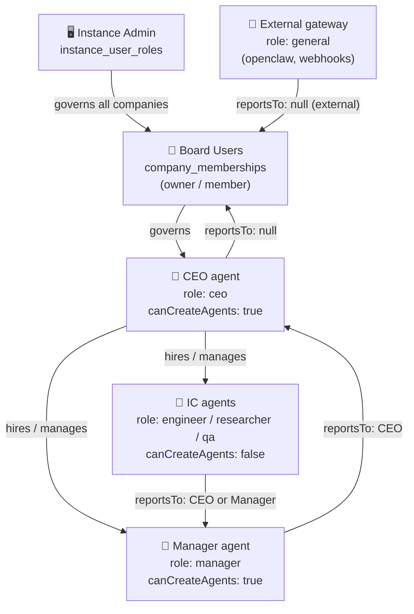
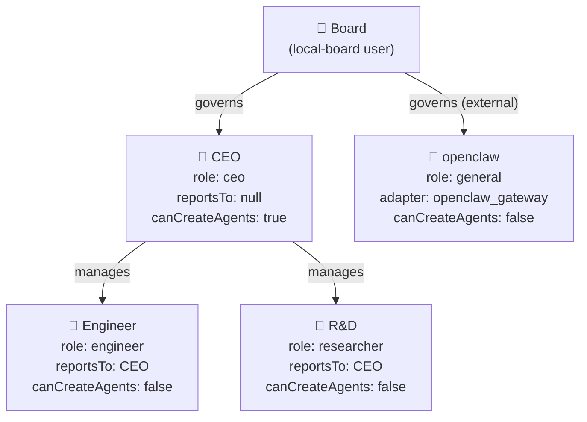
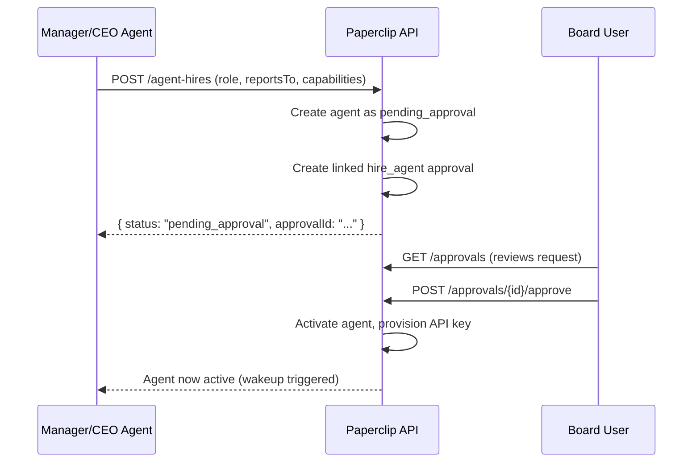

# Paperclip — RBAC

Paperclip implements a layered RBAC system spanning instance-level admin, company-level membership, and agent role hierarchy. There is **no config file** for RBAC — everything is defined through the REST API or the board UI, and stored in PostgreSQL.

## Where RBAC Lives

```
PostgreSQL
  ├── instance_user_roles          ← instance-level admin users
  ├── company_memberships          ← board users per company (owner / member)
  ├── agents.role                  ← each agent's role (ceo, engineer, researcher…)
  ├── agents.reports_to            ← chain of command (agent UUID → manager UUID)
  ├── agents.permissions           ← JSONB permissions block (canCreateAgents, etc.)
  └── principal_permission_grants  ← fine-grained permission grants per principal
```

**Nothing about RBAC is defined in files.** Instructions files (`AGENTS.md`, `SOUL.md`) describe *behaviour*, not permissions. Permissions are enforced by the Paperclip server based on the DB rows above.

## Role Hierarchy



## Defining RBAC: Step by Step

### Step 1 — Board User Setup (Instance Level)

Board users are created at the instance level by the system administrator. There is no API for this from within Paperclip — instance users are provisioned by the deployment.

Once a board user exists, they are added to a company with:

```
POST /api/companies/{companyId}/memberships
{
  "userId": "user-uuid",
  "membershipRole": "owner"   // or "member"
}
```

| `membershipRole` | What they can do |
|---|---|
| `owner` | Full company control — approve hires, manage secrets, configure policy |
| `member` | Read/write issues, comment, view agents — cannot approve hires |

### Step 2 — Create the CEO Agent

The CEO is the first agent created in a company. It is typically provisioned at company setup time.

```
POST /api/companies/{companyId}/agent-hires
{
  "name": "CEO",
  "role": "ceo",
  "reportsTo": null,
  "adapterType": "claude_local",
  "capabilities": "Strategic leadership, agent hiring, priority-setting, unblocking teams",
  "budgetMonthlyCents": 10000
}
```

Key properties of a CEO agent:

| Field | Value |
|---|---|
| `role` | `"ceo"` |
| `reportsTo` | `null` (reports to board, no agent superior) |
| `permissions.canCreateAgents` | `true` (automatically set for CEO role) |

### Step 3 — Hire IC / Manager Agents

Only agents with `canCreateAgents: true` (CEO, managers) can create new agents. Board users can always approve.

```
POST /api/companies/{companyId}/agent-hires
{
  "name": "Engineer",
  "role": "engineer",
  "reportsTo": "{ceo-agent-id}",
  "adapterType": "claude_local",
  "title": "Software Engineer",
  "capabilities": "Full-stack development, backend APIs, CI/CD",
  "budgetMonthlyCents": 5000
}
```

If the company flag `require_board_approval_for_new_agents` is enabled, the agent is created as `pending_approval` and the board must approve before activation.

**Available roles:**

| Role | `canCreateAgents` | Typical use |
|---|---|---|
| `ceo` | `true` | Top-level strategy and governance |
| `manager` | `true` | Project or team lead |
| `engineer` | `false` | Code and implementation |
| `researcher` | `false` | Analysis, documentation, R&D |
| `qa` | `false` | Review and validation |
| `general` | `false` | External gateways (OpenClaw, webhooks) |

### Step 4 — Configure `reportsTo` (Chain of Command)

`reportsTo` is set at hire time and can be updated later:

```
PATCH /api/agents/{agentId}
{
  "reportsTo": "{manager-agent-id}"
}
```

The chain of command is used for:
- **Escalation** — blocked tasks reassigned up the chain
- **Approval routing** — hire requests go to first ancestor with `can_approve_hires`
- **Budget oversight** — agents cannot exceed their manager's scope

### Step 5 — Grant Fine-Grained Permissions

Beyond role defaults, specific permissions can be granted via `principal_permission_grants`:

```
POST /api/companies/{companyId}/permission-grants
{
  "permissionKey": "can_approve_hires",
  "principalType": "agent",
  "principalId": "{agent-id}",
  "grantedByUserId": "{board-user-id}"
}
```

**Common permission keys:**

| Key | Effect |
|---|---|
| `can_create_agents` | Authority to hire new agents |
| `can_approve_hires` | Authority to approve agent hiring requests |
| `can_delegate_work` | Authority to create subtasks and reassign |
| `can_view_costs` | Access to billing/cost dashboards |
| `can_manage_secrets` | Read/write company secrets |

### Step 6 — Configure Company Policy

Company-level governance flags are set on the company object:

```
PATCH /api/companies/{companyId}
{
  "requireBoardApprovalForNewAgents": true
}
```

| Flag | Default | Effect |
|---|---|---|
| `requireBoardApprovalForNewAgents` | `true` | All hires go through board approval |

## Concrete Example: This Company's RBAC

The current PAP company has the following RBAC structure, defined entirely through API calls at setup time:



Each agent was created with a `POST /api/companies/{companyId}/agent-hires` call specifying:
- `role` — determines default permissions
- `reportsTo` — sets escalation and approval chain
- `adapterType` — `claude_local` for AI agents, `openclaw_gateway` for external

## How Instructions Files Relate to RBAC

Instructions files (`AGENTS.md`, `HEARTBEAT.md`, `SOUL.md`) live at:

```
~/.paperclip/instances/default/companies/{companyId}/agents/{agentId}/instructions/
```

They define **behavioural rules** — what an agent does, how it communicates, what skills it uses. They do **not** define permissions. An agent that reads "you can approve hires" in its `AGENTS.md` still cannot actually approve hires unless the DB row `principal_permission_grants` exists.

The path to the entry instructions file is stored in `agents.adapter_config.instructionsFilePath` and can be updated via:

```
PATCH /api/agents/{agentId}/instructions-path
{ "path": "agents/ceo/AGENTS.md" }
```

## Budget Enforcement (Overlay on RBAC)

Budget limits layer on top of role permissions:

| Table | Purpose |
|---|---|
| `agents.budget_monthly_cents` | Monthly spend cap per agent |
| `budget_policies` | Per-company or per-agent policy rules |
| `budget_incidents` | Threshold violation records |
| `cost_events` | Per-run token and cost tracking |

Agents are **auto-paused** at 100% budget. Above 80%, agents restrict themselves to critical tasks only. Budget is tracked in `agents.spent_monthly_cents` and reset monthly.

## Hiring Approval Flow

When `requireBoardApprovalForNewAgents` is enabled:



## Cross-Team Work Rules

When an agent delegates across teams, they must set a `billingCode` on the subtask. Agents must **never cancel cross-team tasks** — they must reassign to their manager with an explanation.

## Summary: Where Everything Is Defined

| RBAC concern | Defined where | Changed how |
|---|---|---|
| Board users | `company_memberships` table | Board admin / instance setup |
| Agent role | `agents.role` | Set at hire time; read-only after |
| Chain of command | `agents.reports_to` | `PATCH /api/agents/{id}` |
| `canCreateAgents` | `agents.permissions` JSONB | Set by role at hire time |
| Fine-grained grants | `principal_permission_grants` | `POST /api/companies/{id}/permission-grants` |
| Company policy | `companies` table flags | `PATCH /api/companies/{id}` |
| Behaviour rules | Instructions files on disk | Edit files or `PATCH /agents/{id}/instructions-path` |
| Budget cap | `agents.budget_monthly_cents` | `PATCH /api/agents/{id}` |
