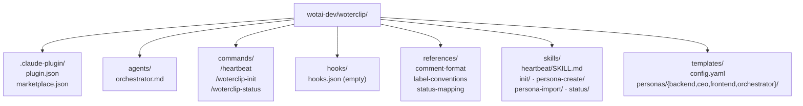
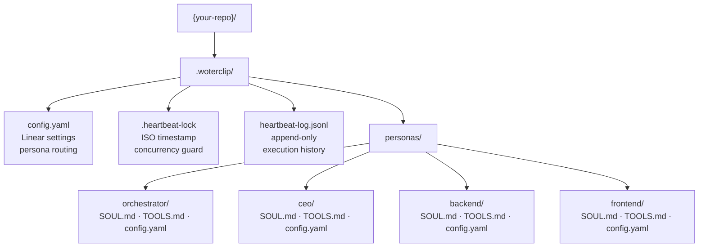

# WoterClip — File Structure

WoterClip has two distinct directory trees: the **plugin package** (installed globally via `claude plugin add`) and the **runtime scaffold** (created per-repo by `/woterclip-init`).

## Plugin Package Layout

This is the repository at `wotai-dev/woterclip`, installed into the Claude Code plugin directory.

```
wotai-dev/woterclip/
├── .claude-plugin/
│   ├── marketplace.json          ← marketplace listing metadata (name, description, tags)
│   └── plugin.json               ← plugin identity (name, version, author, keywords)
│
├── agents/
│   └── orchestrator.md           ← orchestrator agent triage logic (issue selection, routing)
│
├── commands/
│   ├── heartbeat.md              ← /heartbeat slash command definition
│   ├── woterclip-init.md         ← /woterclip-init slash command definition
│   └── woterclip-status.md       ← /woterclip-status slash command definition
│
├── docs/specs/
│   ├── 2026-03-25-woterclip-design.md
│   └── 2026-03-25-woterclip-implementation-plan.md
│
├── hooks/
│   └── hooks.json                ← lifecycle hooks (currently empty: {"hooks": {}})
│
├── references/
│   ├── comment-format.md         ← structured heartbeat comment templates
│   ├── label-conventions.md      ← Linear label lifecycle rules
│   └── status-mapping.md         ← Linear status → agent behaviour mappings
│
├── skills/
│   ├── heartbeat/
│   │   └── SKILL.md              ← 11-step heartbeat execution pipeline
│   ├── heartbeat-log/            ← heartbeat JSONL log management skill
│   ├── init/                     ← /woterclip-init scaffold logic
│   ├── persona-create/           ← new persona creation skill
│   ├── persona-import/           ← persona import from external sources
│   ├── persona-list/             ← list available personas
│   └── status/                   ← /woterclip-status diagnostics skill
│
├── templates/
│   ├── config.yaml               ← per-repo .woterclip/config.yaml template
│   └── personas/
│       ├── backend/              ← backend persona template files
│       ├── ceo/                  ← CEO persona template files
│       ├── frontend/             ← frontend persona template files
│       └── orchestrator/         ← orchestrator persona template files
│
├── .gitignore
├── CLAUDE.md                     ← architecture reference loaded into Claude's context
└── README.md
```



## Runtime Scaffold (per-repo)

When `/woterclip-init` runs in a target repository it creates a `.woterclip/` directory from the bundled templates.

```
{your-repo}/
└── .woterclip/
    ├── config.yaml               ← Linear workspace ID, heartbeat config, persona routing map
    ├── .heartbeat-lock           ← ISO timestamp lockfile (prevents concurrent runs)
    ├── heartbeat-log.jsonl       ← append-only JSONL execution history
    └── personas/
        ├── orchestrator/
        │   ├── SOUL.md           ← identity, voice, decision-making constraints
        │   ├── TOOLS.md          ← available MCP tools and usage patterns
        │   └── config.yaml       ← model, thinking budget, max turns per heartbeat
        ├── ceo/
        │   ├── SOUL.md
        │   ├── TOOLS.md
        │   └── config.yaml
        ├── backend/
        │   ├── SOUL.md
        │   ├── TOOLS.md
        │   └── config.yaml
        └── frontend/
            ├── SOUL.md
            ├── TOOLS.md
            └── config.yaml
```



## Persona File Reference

Every persona directory contains exactly three files:

| File | Purpose | Example content |
|---|---|---|
| `SOUL.md` | Identity, voice, and decision-making constraints | "You are a senior backend engineer. Prioritise correctness over speed…" |
| `TOOLS.md` | Available MCP integrations and usage patterns | Linear MCP prefix, GitHub MCP calls, file operations |
| `config.yaml` | Runtime knobs for this persona | `model`, `thinking.budget_tokens`, `max_turns` |

## config.yaml Reference

The top-level `.woterclip/config.yaml` controls heartbeat behaviour:

```yaml
linear:
  workspace_id: "your-workspace-id"
  team_id: "your-team-id"

heartbeat:
  quiet_hours:
    start: "22:00"
    end: "08:00"
  stale_lock_hours: 4          # age at which .heartbeat-lock is considered stale
  error_cooldown_minutes: 30   # wait after a fatal error before retrying

personas:
  routing:
    backend: backend           # Linear label → persona directory name
    frontend: frontend
    ceo: ceo
    # default (no label): orchestrator
```

## Summary Table

| Path | Type | Purpose | Writable by |
|---|---|---|---|
| `plugin.json` | JSON | Plugin identity and metadata | Plugin author |
| `commands/*.md` | Markdown | Slash command definitions | Plugin author |
| `skills/heartbeat/SKILL.md` | Markdown | 11-step heartbeat pipeline spec | Plugin author |
| `templates/config.yaml` | YAML | Template for per-repo config | Plugin author |
| `templates/personas/*/` | Markdown/YAML | Starter persona definitions | Plugin author |
| `.woterclip/config.yaml` | YAML | Runtime config (per repo) | Developer |
| `.woterclip/.heartbeat-lock` | Text | ISO timestamp concurrency guard | WoterClip runtime |
| `.woterclip/heartbeat-log.jsonl` | JSONL | Append-only run history | WoterClip runtime |
| `.woterclip/personas/*/SOUL.md` | Markdown | Persona identity loaded into context | Developer / persona skills |
| `.woterclip/personas/*/TOOLS.md` | Markdown | Tool usage notes for the persona | Developer / persona skills |
| `.woterclip/personas/*/config.yaml` | YAML | Model + turn budget for the persona | Developer |
