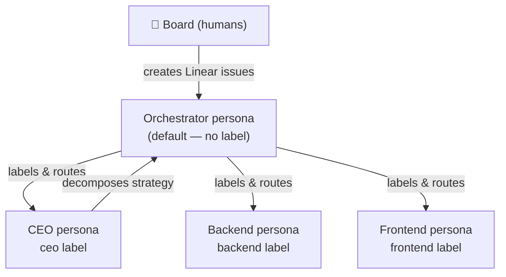

# WoterClip

WoterClip (`wotai-dev/woterclip`) is a **Claude Code plugin** that enables Linear-backed agent orchestration through persona-based task routing. A single Claude instance dynamically adopts specialised "personas" (roles) determined by Linear issue labels, then executes work in automated heartbeat cycles.

> **Design philosophy:** Fully declarative and markdown-based — no compiled code. Agent behaviour is defined in YAML and Markdown files that Claude interprets at runtime.

## Architecture at a Glance

```
Board (humans)
    │
    ▼
Linear (issue tracker / state machine)
    │
    ├── Issues → persona labels (backend, frontend, ceo…)
    └── Comments → heartbeat counter + feedback
            │
            ▼
      Claude Code (via plugin)
            │
            ├── /heartbeat  ←  runs one full cycle
            ├── Orchestrator persona (triage)
            └── Worker personas (backend, frontend, ceo…)
                    │
                    └── .woterclip/ (local config + logs + lockfile)
```

## Organisational Hierarchy

WoterClip uses a four-tier hierarchy, entirely implemented in Markdown persona files:

| Tier | Entity | Role |
|---|---|---|
| 1 | Board (humans) | Create issues, give feedback in comments |
| 2 | CEO persona | Strategy, architecture, cross-cutting decisions |
| 3 | Orchestrator persona | Triage, routing, decomposition |
| 4 | Worker personas | Backend, Frontend — implementation |



## Key Subsystems

| Subsystem | Description |
|---|---|
| [File Structure](/docs/woterclip/file-structure) | Plugin layout and runtime `.woterclip/` scaffold |
| [Memory System](/docs/woterclip/memory) | Three-layer state: Linear labels, local files, comment-derived counters |

## Technology Stack

- **Plugin format:** Claude Code plugin (`plugin.json` + `.claude-plugin/marketplace.json`)
- **Issue tracker:** Linear (all persistent state lives here)
- **Agent runtime:** Claude Code (local — no server component)
- **Configuration:** YAML files in `.woterclip/`
- **Skill files:** Markdown slash-commands (`/heartbeat`, `/woterclip-init`, `/woterclip-status`)

## Installation

```bash
claude plugin add wotai-dev/woterclip
# then in your target repo:
/woterclip-init
```

`/woterclip-init` scaffolds a `.woterclip/` directory from the bundled templates, creating config, personas, and log files.
