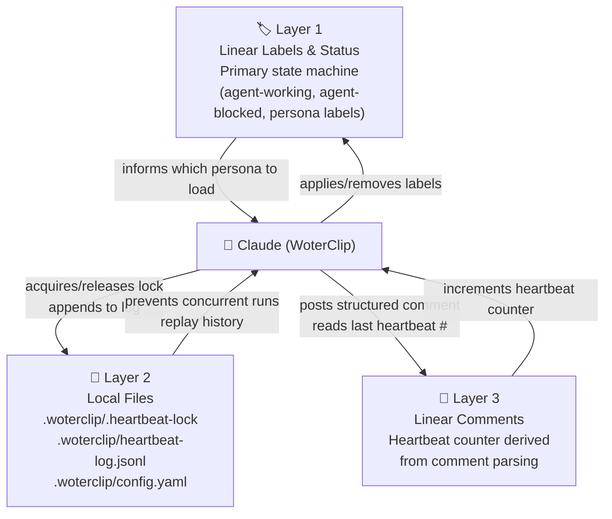

# WoterClip — Memory System

WoterClip uses **three distinct layers** of state — none involving a traditional database. All persistence is either in Linear (the SaaS issue tracker) or in plain files on the local machine.



## Layer 1: Linear as the Primary State Machine

Linear issues, labels, and comments are the **authoritative state store**. All agent state transitions are expressed as label changes:

| Label | Meaning | Applied by |
|---|---|---|
| `agent-working` | Agent is actively processing this issue | WoterClip (step 6 of heartbeat) |
| `agent-blocked` | Human intervention required | WoterClip (on block detection) |
| `backend` | Route to backend persona | Developer or orchestrator |
| `frontend` | Route to frontend persona | Developer or orchestrator |
| `ceo` | Route to CEO persona | Developer or orchestrator |
| *(none)* | Route to orchestrator (default) | — |

**Label management follows a read-modify-write pattern:**

```
1. GET issue labels (current full set)
2. Append or remove the target label
3. PUT full label set back (Linear replaces, not appends)
```

**Stale lock cleanup:** `agent-working` labels older than `stale_lock_hours` (default: 4h) are automatically removed at heartbeat start, preventing permanently locked issues if a run crashes.

**Blocking detection:** An issue is considered blocked if it has the `agent-blocked` label AND no new human comment has been posted since the label was applied. When a human comments, the label is cleared and the issue re-enters the queue.

## Layer 2: Local File-Based Memory

Three files in `.woterclip/` provide local process state: `.heartbeat-lock` (concurrency guard), `heartbeat-log.jsonl` (append-only execution history), and `config.yaml` (routing config). See [File Structure](/docs/research/human/paperclip/memory/woterclip/file-structure) for the full layout and schema.

## Layer 3: Heartbeat Counter via Comment Parsing

There is **no dedicated counter file**. WoterClip derives the heartbeat number at runtime by parsing Linear comments:

```
1. Fetch comments on the current issue
2. Find the most recent comment authored by WoterClip
3. Parse for the pattern "Heartbeat #N"
4. Increment N → use as current heartbeat number
5. If no prior comment found → start at #1
```

**Implication:** Deleting WoterClip's comments resets the counter for that issue. This is intentional — the counter is informational, not functional. The `heartbeat-log.jsonl` is the authoritative execution history.

## Comparison: What Lives Where

| State | Storage location | Persistent across runs? | Human-readable? |
|---|---|---|---|
| Issue status (todo, in_progress…) | Linear issue `status` field | Yes | Yes (Linear UI) |
| Persona routing | Linear issue labels | Yes | Yes (Linear UI) |
| Blocking state | `agent-blocked` label | Yes (until cleared) | Yes (Linear UI) |
| Concurrency guard | `.woterclip/.heartbeat-lock` | No (deleted after run) | Yes (plain text) |
| Execution history | `.woterclip/heartbeat-log.jsonl` | Yes (append-only) | Yes (JSONL) |
| Heartbeat counter | Derived from Linear comments | Informational only | Yes (in comment body) |
| Persona identity | `.woterclip/personas/{name}/SOUL.md` | Yes (static config) | Yes (Markdown) |
| Agent behaviour | `.woterclip/personas/{name}/TOOLS.md` | Yes (static config) | Yes (Markdown) |

## Key Design Trade-offs

| Decision | Trade-off |
|---|---|
| Linear as state machine | No local DB required; state is visible in the same UI humans use; but depends on Linear availability |
| No heartbeat counter file | Simpler file layout; counter resets on comment delete; but functional correctness is unaffected |
| Append-only JSONL log | Never lose history; but log grows unbounded without manual cleanup |
| Lockfile (not DB row) | Works without any server component; but process crashes may leave stale locks (mitigated by TTL) |
